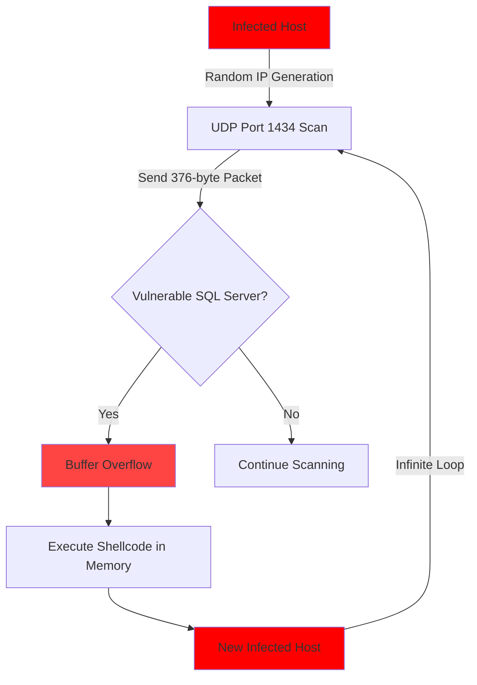
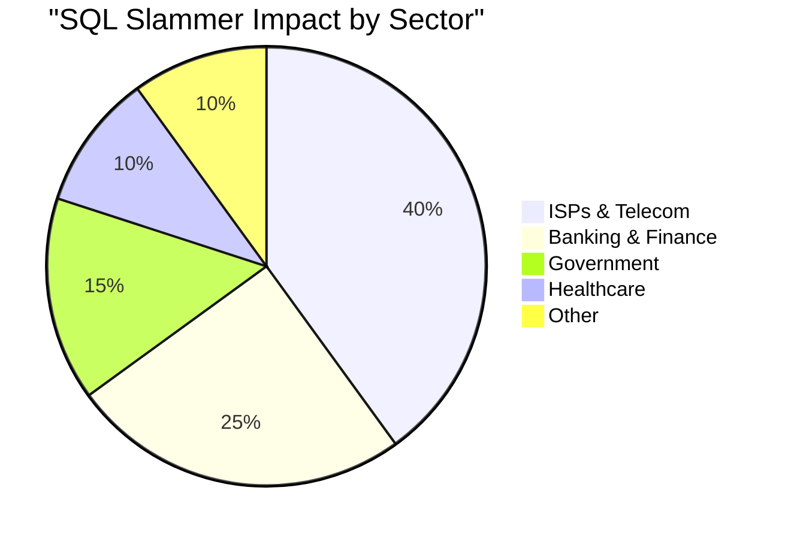
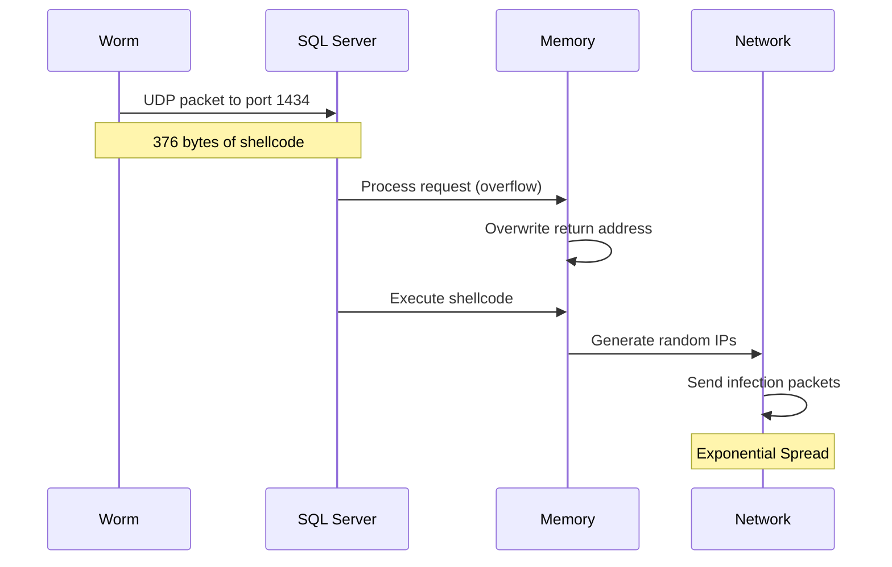
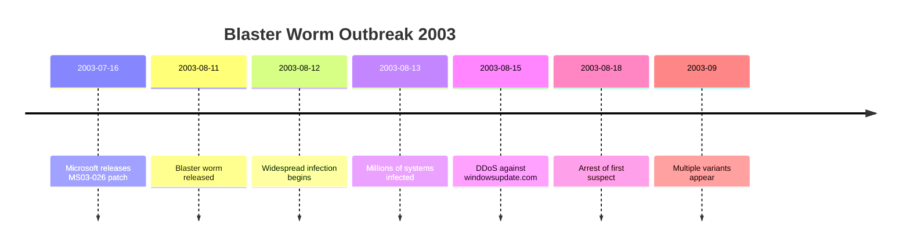
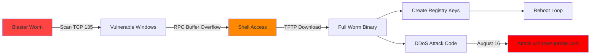
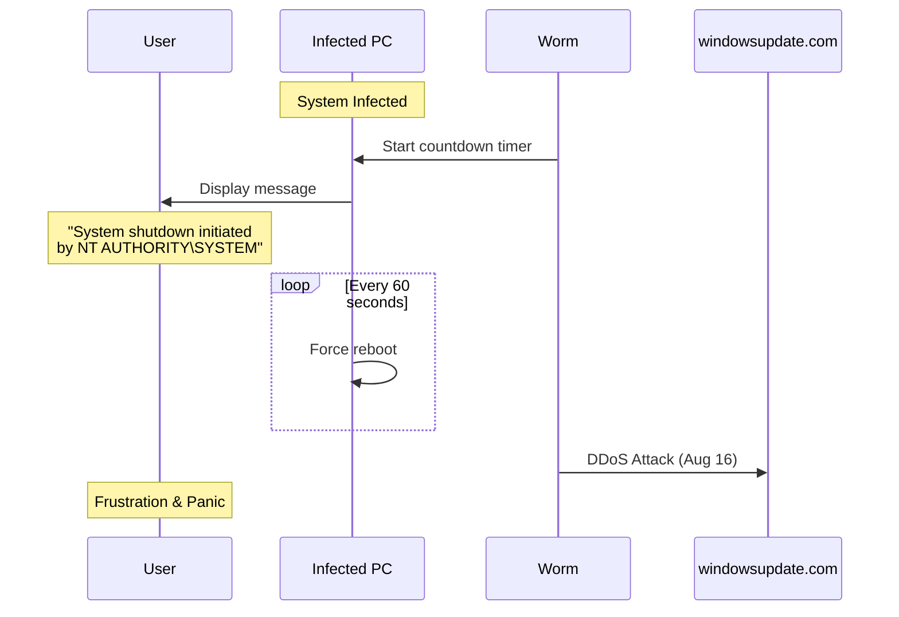
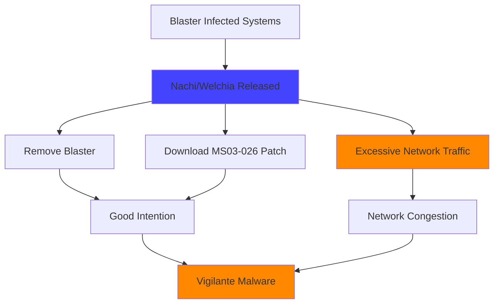
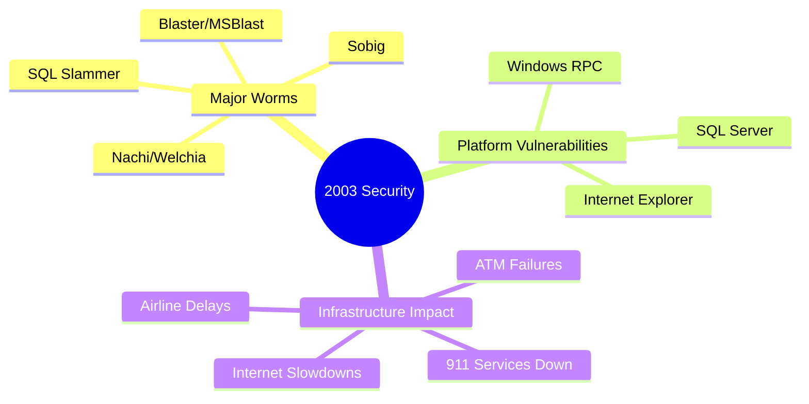
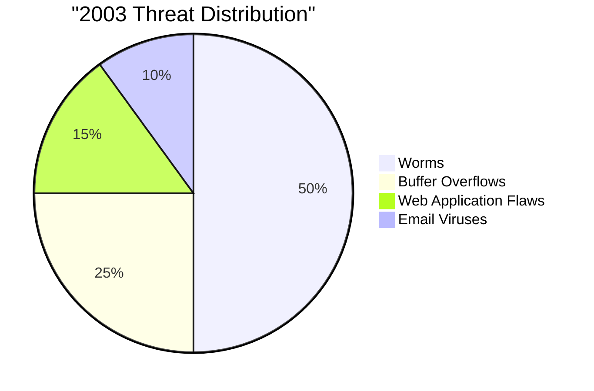

# CVE Analysis - 2003

## 📊 Overview

2003 was a pivotal year in cybersecurity history, marked by the SQL Slammer worm, the Blaster worm, and numerous critical vulnerabilities in Windows and web applications. This was an era when internet worms could spread globally in minutes.

## 🔴 Critical Vulnerabilities (9.0 - 10.0)

| CVE ID | CVSS Score | Software/Service | Description | Tags |
|--------|------------|------------------|-------------|------|
| [CVE-2003-0352](https://nvd.nist.gov/vuln/detail/CVE-2003-0352) | 10.0 | Windows RPC/DCOM | Blaster/MSBlast Worm | `Windows`, `RPC`, `Worm`, `RCE` |
| [CVE-2002-0649](https://nvd.nist.gov/vuln/detail/CVE-2002-0649) | 10.0 | SQL Server 2000 | SQL Slammer Worm | `SQL Server`, `Worm`, `Buffer Overflow` |
| [CVE-2003-0533](https://nvd.nist.gov/vuln/detail/CVE-2003-0533) | 10.0 | OpenSSL | Multiple Vulnerabilities | `OpenSSL`, `SSL`, `ASN.1` |
| [CVE-2003-0818](https://nvd.nist.gov/vuln/detail/CVE-2003-0818) | 10.0 | Windows ASN.1 | MS04-007 ASN.1 Vulnerability | `Windows`, `ASN.1`, `RCE` |
| [CVE-2003-0109](https://nvd.nist.gov/vuln/detail/CVE-2003-0109) | 7.5 | Apache HTTP | Chunk Encoding | `Apache`, `Web Server`, `Buffer Overflow` |

## 🟠 High Severity (7.0 - 8.9)

| CVE ID | CVSS Score | Software/Service | Description | Tags |
|--------|------------|------------------|-------------|------|
| [CVE-2003-0201](https://nvd.nist.gov/vuln/detail/CVE-2003-0201) | 7.5 | Samba | Remote Root Access | `Samba`, `Linux`, `Buffer Overflow` |
| [CVE-2003-0244](https://nvd.nist.gov/vuln/detail/CVE-2003-0244) | 10.0 | Windows Locator Service | RPC Vulnerability | `Windows`, `RPC`, `RCE` |
| [CVE-2003-0542](https://nvd.nist.gov/vuln/detail/CVE-2003-0542) | 7.5 | Apache mod_alias | Path Disclosure | `Apache`, `Web Server` |

## 🟡 Medium Severity (4.0 - 6.9)

| CVE ID | CVSS Score | Software/Service | Description | Tags |
|--------|------------|------------------|-------------|------|
| [CVE-2003-0190](https://nvd.nist.gov/vuln/detail/CVE-2003-0190) | 7.5 | OpenSSH | PAM Authentication Vulnerability | `OpenSSH`, `SSH`, `Authentication` |

## 🔍 Notable CVE Deep Dive

### CVE-2002-0649: SQL Slammer Worm (CRITICAL)

**CVSS Score**: 10.0  
**Affected Software**: Microsoft SQL Server 2000, MSDE 2000  
**Attack Vector**: Network (UDP Port 1434)  
**Impact**: Fastest Spreading Computer Worm in History

#### Description
SQL Slammer (also known as Sapphire) exploited a buffer overflow in Microsoft SQL Server's Resolution Service. The worm was only 376 bytes and resided entirely in memory, making it extremely fast at spreading. It doubled infected hosts approximately every 8.5 seconds, reaching peak infection in under 10 minutes.

#### Historical Context
While this CVE was assigned in 2002, SQL Slammer struck on **January 25, 2003**, becoming one of the most significant worm outbreaks in internet history.

#### Infection Timeline

```mermaid
timeline
    title SQL Slammer Global Spread (January 25, 2003)
    05:30 UTC : Worm Released
    05:35 UTC : 10,000 hosts infected
    05:40 UTC : 75,000 hosts infected (doubling every 8.5s)
    05:45 UTC : Global Internet Impact
    06:00 UTC : Peak infection - Internet degraded
    12:00 UTC : 200,000+ hosts infected
```

#### Propagation Mechanism



#### Global Impact



#### Notable Incidents
- **Bank of America**: 13,000 ATMs offline
- **911 Emergency Services**: Seattle's emergency dispatch system failed
- **Continental Airlines**: Flight check-ins and online ticketing disrupted
- **South Korea**: Internet connectivity reduced by 30%
- **Global Internet**: 5% degradation in overall traffic

#### Technical Details



#### Why It Spread So Fast
1. **Tiny Size**: 376 bytes could fit in a single UDP packet
2. **Memory Resident**: No file system interaction
3. **Random Scanning**: Massive parallel infection attempts
4. **No Payload**: Only goal was to spread (no malicious payload to slow it down)
5. **UDP Protocol**: No connection handshake required
6. **Widespread Vulnerable Systems**: Many unpatched SQL Servers

#### Mitigation
- Apply Microsoft Security Bulletin MS02-039 (released 6 months before outbreak)
- Block UDP port 1434 at firewall
- Disable SQL Server Resolution Service if not needed
- Network segmentation
- Implement rate limiting

#### Lessons Learned
- **Patch Management**: Critical patches must be applied promptly
- **Network Architecture**: Internet-facing database servers are dangerous
- **Minimal Attack Surface**: Disable unnecessary services
- **Monitoring**: Early detection systems needed

#### References
- [NVD Entry](https://nvd.nist.gov/vuln/detail/CVE-2002-0649)
- [Microsoft Security Bulletin MS02-039](https://docs.microsoft.com/en-us/security-updates/securitybulletins/2002/ms02-039)
- [CAIDA Analysis](https://www.caida.org/publications/papers/2003/sapphire/)

---

### CVE-2003-0352: Blaster/MSBlast Worm (CRITICAL)

**CVSS Score**: 10.0  
**Affected Software**: Windows 2000, XP, Server 2003  
**Attack Vector**: Network (TCP Port 135)  
**Impact**: Millions of Windows Systems Compromised

#### Description
The Blaster worm (also known as MSBlast or Lovesan) exploited a buffer overflow in Windows RPC DCOM interface. Unlike SQL Slammer, Blaster had a malicious payload designed to launch a DDoS attack against Microsoft's Windows Update website.

#### Attack Timeline



#### Infection Mechanism



#### Visual Impact



#### Message Displayed
The worm displayed this message before forcing reboots:
```
This system is shutting down. Please save all work in progress
and log off. Any unsaved changes will be lost.
This shutdown was initiated by NT AUTHORITY\SYSTEM

Time before shutdown: 00:00:60
```

#### Blaster Variants
- **Blaster.A** (Original)
- **Blaster.B** (Nachi/Welchia - attempted to remove Blaster and patch systems)
- **Blaster.C** through **Blaster.F** (Various modifications)

#### Impact Statistics
- **8-16 million** computers infected worldwide
- **$2-10 billion** in damage estimates
- **Air Canada**: Check-in systems disrupted
- **CSX**: Train signaling systems affected
- **Maryland Motor Vehicle Administration**: 13 offices closed

#### The Nachi Worm Paradox



#### Mitigation
1. **Immediate**:
   - Apply MS03-026 security update
   - Enable Windows Firewall
   - Block TCP port 135 at network perimeter
   
2. **Manual Removal**:
   ```
   # Stop the service
   net stop "Windows Auto Update"
   
   # Remove registry entries
   HKLM\SOFTWARE\Microsoft\Windows\CurrentVersion\Run
   Delete value: "windows auto update" or "microsoft"
   
   # Delete worm files
   %SystemRoot%\system32\msblast.exe
   %SystemRoot%\system32\teekids.exe
   %SystemRoot%\system32\penis32.exe
   ```

3. **Prevention**:
   - Automatic updates enabled
   - Network segmentation
   - IDS/IPS deployment

#### References
- [NVD Entry](https://nvd.nist.gov/vuln/detail/CVE-2003-0352)
- [Microsoft Security Bulletin MS03-026](https://docs.microsoft.com/en-us/security-updates/securitybulletins/2003/ms03-026)
- [CERT Advisory](https://www.kb.cert.org/vuls/id/568148)

---

## 📈 2003 Cybersecurity Landscape





## 🏷️ Technology Tags Summary

- **Windows**: 30+ CVEs
- **SQL Server**: 5 CVEs
- **Web Servers**: 15+ CVEs
- **OpenSSL**: 8 CVEs
- **Network Services**: 20+ CVEs

## 💡 2003 Security Lessons

1. **Worm Propagation**: Small vulnerabilities can enable massive global impact
2. **Patching Urgency**: Both major worms had patches available before outbreak
3. **Attack Surface**: Exposed services must be minimized
4. **Firewall Necessity**: Desktop firewalls became essential
5. **Internet Resilience**: Infrastructure vulnerabilities exposed

## 🌍 Cultural Impact

2003 marked a turning point where:
- **Cybersecurity** entered mainstream consciousness
- **Automatic updates** became standard practice
- **Firewall software** became mandatory
- **Security awareness** training expanded
- **Incident response** teams became common

## 📚 Additional Resources

- [SQL Slammer Analysis - CAIDA](https://www.caida.org/publications/papers/2003/sapphire/)
- [Blaster Worm Timeline - Symantec](https://www.symantec.com/security-center/writeup/2003-081108-0229-99)
- [2003 Threat Landscape - CERT](https://www.cert.org/historical/)
- [NVD 2003 Database](https://nvd.nist.gov/vuln/search/results?isCpeNameSearch=false&pub_start_date=01/01/2003&pub_end_date=12/31/2003)

---

**Note**: 2003 demonstrated that the internet was vulnerable to rapid, global attacks and led to fundamental changes in security practices.
