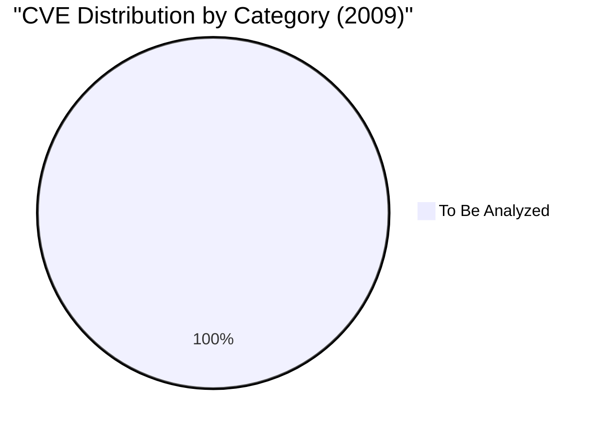

# CVE Analysis - 2009

## 📊 Overview

This folder contains Critical Vulnerabilities and Exposures identified in 2009, organized by severity rating.

## 🔴 Critical Vulnerabilities (9.0 - 10.0)

| CVE ID | CVSS Score | Software/Service | Description | Tags |
|--------|------------|------------------|-------------|------|
| TBD | - | - | To be populated | - |

## 🟠 High Severity (7.0 - 8.9)

| CVE ID | CVSS Score | Software/Service | Description | Tags |
|--------|------------|------------------|-------------|------|
| TBD | - | - | To be populated | - |

## 🟡 Medium Severity (4.0 - 6.9)

| CVE ID | CVSS Score | Software/Service | Description | Tags |
|--------|------------|------------------|-------------|------|
| TBD | - | - | To be populated | - |

## 🟢 Low Severity (0.1 - 3.9)

| CVE ID | CVSS Score | Software/Service | Description | Tags |
|--------|------------|------------------|-------------|------|
| TBD | - | - | To be populated | - |

## 🔍 Notable CVE Deep Dive

This section will contain detailed analysis of significant vulnerabilities from 2009, including:
- Attack mechanisms
- Impact analysis
- Mermaid diagrams
- Mitigation strategies
- References to official documentation

## 📈 2009 Vulnerability Trends

## 🏷️ Technology Tags Summary

To be populated with specific technology categories and CVE counts.

## 📚 Additional Resources

- [NVD 2009 Vulnerabilities](https://nvd.nist.gov/vuln/search/results?isCpeNameSearch=false&pub_start_date=01/01/2009&pub_end_date=12/31/2009)
- [CISA Known Exploited Vulnerabilities](https://www.cisa.gov/known-exploited-vulnerabilities-catalog)
- [CVE.org](https://cve.org/)

---

**Note**: This year's CVE analysis is pending detailed research and documentation. Contributions are welcome!
