# CVE Analysis - 2014

## 📊 Overview

2014 was a landmark year in cybersecurity, featuring two of the most critical vulnerabilities ever discovered: Heartbleed and Shellshock. These vulnerabilities affected fundamental components used across millions of systems worldwide.

## 🔴 Critical Vulnerabilities (9.0 - 10.0)

| CVE ID | CVSS Score | Software/Service | Description | Tags |
|--------|------------|------------------|-------------|------|
| [CVE-2014-6271](https://nvd.nist.gov/vuln/detail/CVE-2014-6271) | 10.0 | Bash | Shellshock RCE | `Bash`, `Linux`, `Unix`, `RCE` |
| [CVE-2014-7169](https://nvd.nist.gov/vuln/detail/CVE-2014-7169) | 10.0 | Bash | Shellshock Incomplete Fix | `Bash`, `Linux`, `Unix`, `RCE` |
| [CVE-2014-0224](https://nvd.nist.gov/vuln/detail/CVE-2014-0224) | 6.8 | OpenSSL | MITM CCS Injection | `OpenSSL`, `TLS`, `MITM` |
| [CVE-2014-3566](https://nvd.nist.gov/vuln/detail/CVE-2014-3566) | 3.4 | SSL 3.0 | POODLE Attack | `SSL`, `TLS`, `Protocol`, `Padding Oracle` |

## 🟠 High Severity (7.0 - 8.9)

| CVE ID | CVSS Score | Software/Service | Description | Tags |
|--------|------------|------------------|-------------|------|
| [CVE-2014-0160](https://nvd.nist.gov/vuln/detail/CVE-2014-0160) | 7.5 | OpenSSL | Heartbleed - Memory Disclosure | `OpenSSL`, `TLS`, `Memory Leak`, `Encryption` |
| [CVE-2014-4877](https://nvd.nist.gov/vuln/detail/CVE-2014-4877) | 8.3 | GNU Wget | Symlink Attack | `Linux`, `Wget`, `File System` |
| [CVE-2014-1776](https://nvd.nist.gov/vuln/detail/CVE-2014-1776) | 9.3 | Internet Explorer | Use-After-Free RCE | `Microsoft`, `IE`, `RCE` |
| [CVE-2014-8361](https://nvd.nist.gov/vuln/detail/CVE-2014-8361) | 9.0 | Realtek SDK | Multiple Router Backdoors | `Router`, `IoT`, `Backdoor` |

## 🟡 Medium Severity (4.0 - 6.9)

| CVE ID | CVSS Score | Software/Service | Description | Tags |
|--------|------------|------------------|-------------|------|
| [CVE-2014-0195](https://nvd.nist.gov/vuln/detail/CVE-2014-0195) | 6.8 | OpenSSL | DTLS Fragment Processing | `OpenSSL`, `DTLS` |

## 🔍 Notable CVE Deep Dive

### CVE-2014-0160: Heartbleed (CRITICAL)

**CVSS Score**: 7.5 (Later re-evaluated to higher)  
**Affected Software**: OpenSSL 1.0.1 through 1.0.1f  
**Attack Vector**: Network  
**Impact**: Memory Disclosure, Secret Key Theft

#### Description
Heartbleed is a critical vulnerability in OpenSSL's implementation of the TLS/DTLS heartbeat extension. It allows attackers to read up to 64KB of server memory per request, potentially exposing sensitive data including private keys, passwords, and session cookies. The vulnerability existed for over two years before discovery.

#### How Heartbleed Works

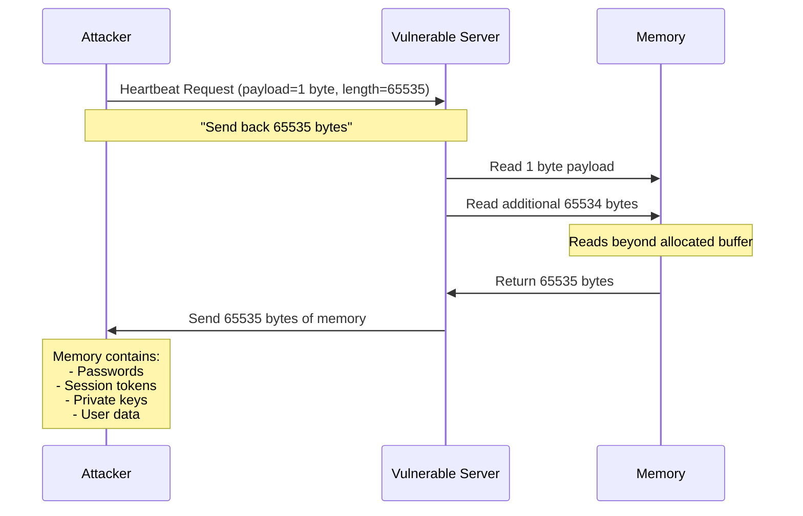

#### The Vulnerability

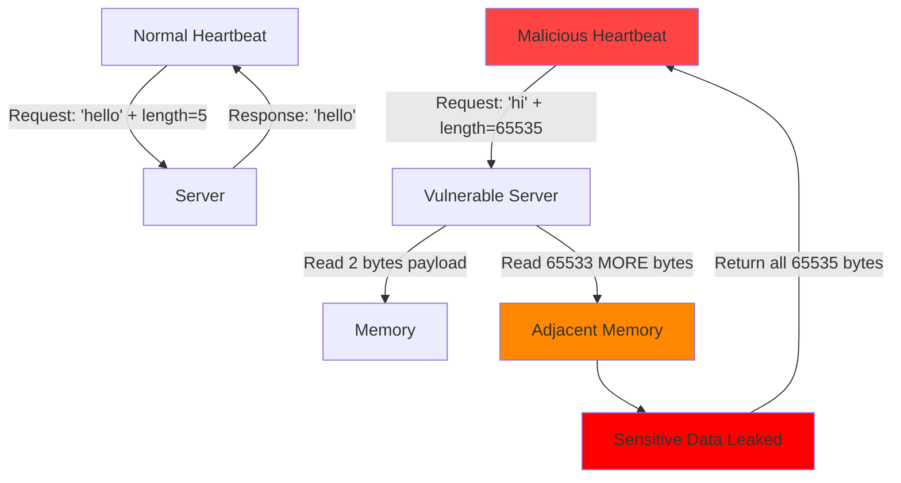

#### Global Impact

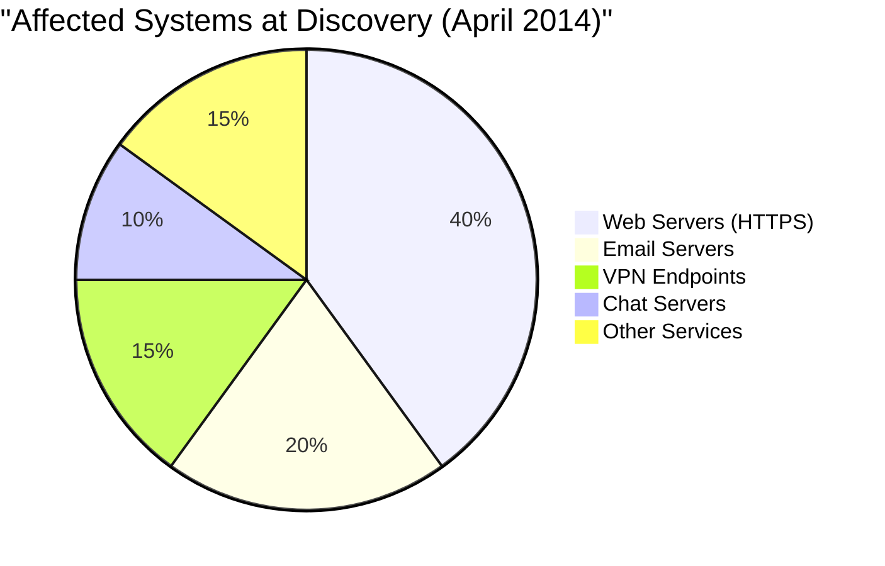

#### What Could Be Stolen

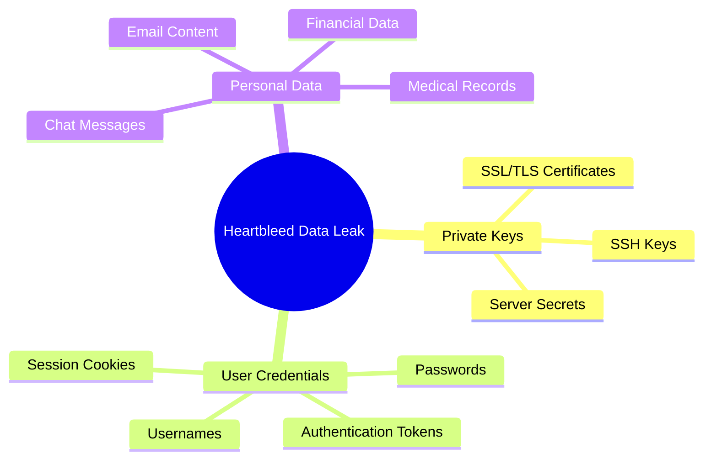

#### Timeline

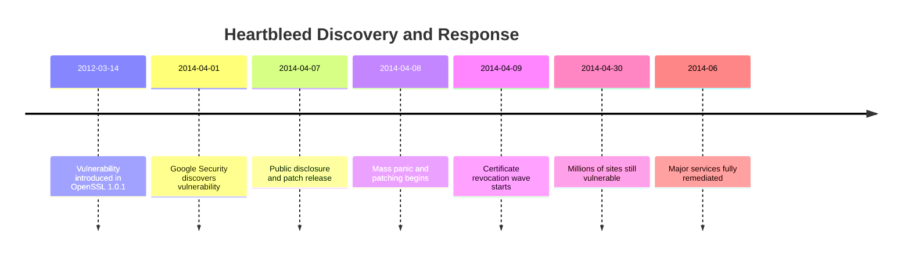

#### Real-World Exploits
- **CRA (Canada)**: Social Insurance Numbers of 900 taxpayers stolen
- **Community Health Systems**: 4.5 million patient records exposed
- **Yahoo**: Unknown amount of data compromised
- Countless small businesses and services affected

#### Mitigation Steps
1. **Immediate**:
   - Update to OpenSSL 1.0.1g or later
   - Revoke compromised SSL certificates
   - Generate new private keys
   - Issue new certificates

2. **Follow-up**:
   - Force password resets for users
   - Invalidate all session tokens
   - Monitor for suspicious activity
   - Audit systems for previous exploitation

3. **Verification**:
   ```bash
   # Check OpenSSL version
   openssl version -a
   
   # Test for vulnerability
   # Use online scanners or tools like heartbleed-test
   ```

#### References
- [NVD Entry](https://nvd.nist.gov/vuln/detail/CVE-2014-0160)
- [Heartbleed.com Official Site](http://heartbleed.com/)
- [OpenSSL Security Advisory](https://www.openssl.org/news/secadv/20140407.txt)
- [CloudFlare Technical Analysis](https://blog.cloudflare.com/staying-ahead-of-openssl-vulnerabilities/)

---

### CVE-2014-6271: Shellshock (CRITICAL)

**CVSS Score**: 10.0  
**Affected Software**: GNU Bash through 4.3  
**Attack Vector**: Network/Local  
**Impact**: Complete System Compromise

#### Description
Shellshock is a family of vulnerabilities in Bash (Bourne Again Shell) that allows attackers to execute arbitrary commands by exploiting how Bash processes environment variables. The vulnerability existed for 25 years, affecting countless Unix/Linux systems worldwide.

#### Vulnerability Mechanism

```mermaid
graph LR
    A[Attacker Input] -->|Crafted Environment Variable| B[Bash Parser]
    B -->|env x='() { :;}; command'| C[Function Definition]
    C -->|Parser Continues After Function| D[Execute Trailing Commands]
    D --> E[Arbitrary Code Execution]
    
    style A fill:#ff4444
    style D fill:#ff8800
    style E fill:#ff0000
```

#### Exploitation Examples

```mermaid
sequenceDiagram
    participant Attacker
    participant Web Server (CGI)
    participant Bash
    participant System
    
    Attacker->>Web Server (CGI): HTTP Request with User-Agent
    Note over Attacker,Web Server (CGI): User-Agent: () { :;}; /bin/cat /etc/passwd
    Web Server (CGI)->>Bash: Set HTTP_USER_AGENT env variable
    Bash->>Bash: Parse function definition
    Bash->>Bash: Continue parsing after "}"
    Bash->>System: Execute /bin/cat /etc/passwd
    System->>Bash: File contents
    Bash->>Web Server (CGI): Return output
    Web Server (CGI)->>Attacker: Leak /etc/passwd
    
    Note over System: System Compromised
```

#### Attack Vectors

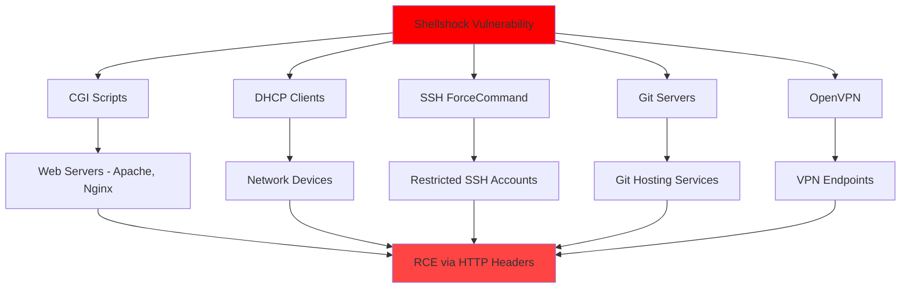

#### Affected Systems (Estimate)
- **500 million+** devices vulnerable initially
- Servers, routers, IoT devices, embedded systems
- macOS systems (shipped with vulnerable Bash)
- Most Linux distributions
- Network appliances

#### Proof of Concept
```bash
# Test for Shellshock
env x='() { :;}; echo vulnerable' bash -c "echo test"

# If vulnerable, output will be:
# vulnerable
# test

# Exploitation example (CGI)
curl -A "() { :;}; echo 'Content-Type: text/plain'; echo; /usr/bin/id" \
     http://victim.com/cgi-bin/script.sh
```

#### Cascading Vulnerabilities

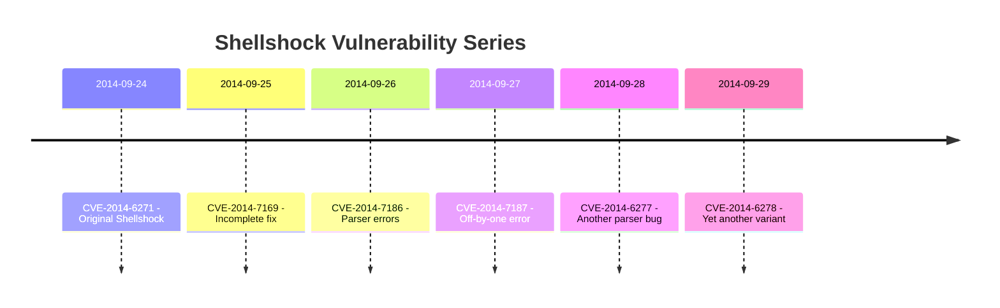

#### Real-World Impact
- **Yahoo servers** compromised within hours
- **Botnets** created exploiting IoT devices
- **Cryptocurrency mining** malware deployed
- **DDoS attacks** launched from compromised systems
- **Millions of scans** detected worldwide daily

#### Mitigation
1. **Patch Bash immediately**:
   ```bash
   # Check version
   bash --version
   
   # Update (Debian/Ubuntu)
   sudo apt-get update && sudo apt-get install bash
   
   # Update (RHEL/CentOS)
   sudo yum update bash
   
   # Update (macOS)
   # Download and install from Apple
   ```

2. **Temporary Workarounds**:
   - Disable CGI scripts
   - Filter HTTP headers at firewall
   - Restrict Bash usage
   - Use alternative shells

3. **Detection**:
   - Review web server logs for suspicious patterns
   - Monitor for unexpected bash processes
   - Check for backdoors and malware

#### References
- [NVD Entry](https://nvd.nist.gov/vuln/detail/CVE-2014-6271)
- [Red Hat Shellshock Analysis](https://access.redhat.com/articles/1200223)
- [NIST Shellshock Guide](https://www.nist.gov/news-events/news/2014/09/nist-releases-guidance-shellshock-vulnerability)

---

### CVE-2014-3566: POODLE Attack (SSL 3.0)

**CVSS Score**: 3.4  
**Affected Software**: SSL 3.0 Protocol  
**Attack Vector**: Man-in-the-Middle  
**Impact**: Plaintext Recovery from Encrypted Connections

#### Description
POODLE (Padding Oracle On Downgraded Legacy Encryption) is an attack against SSL 3.0 that allows attackers to decrypt secure connections by exploiting weaknesses in CBC mode cipher encryption with padding.

#### Attack Flow

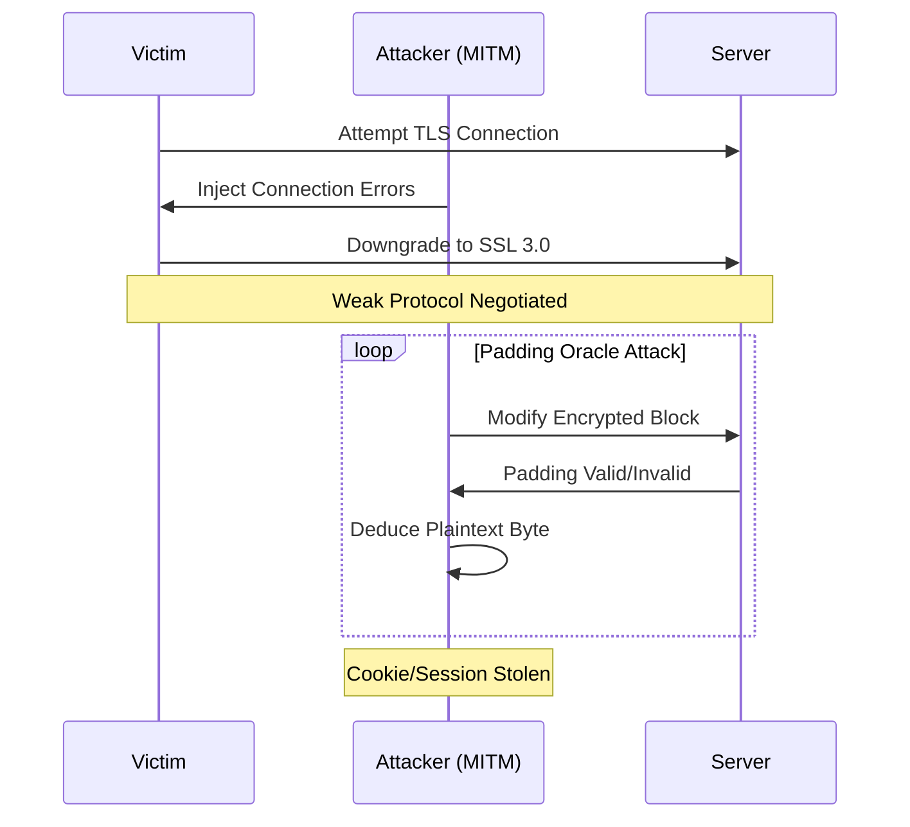

#### Impact Assessment

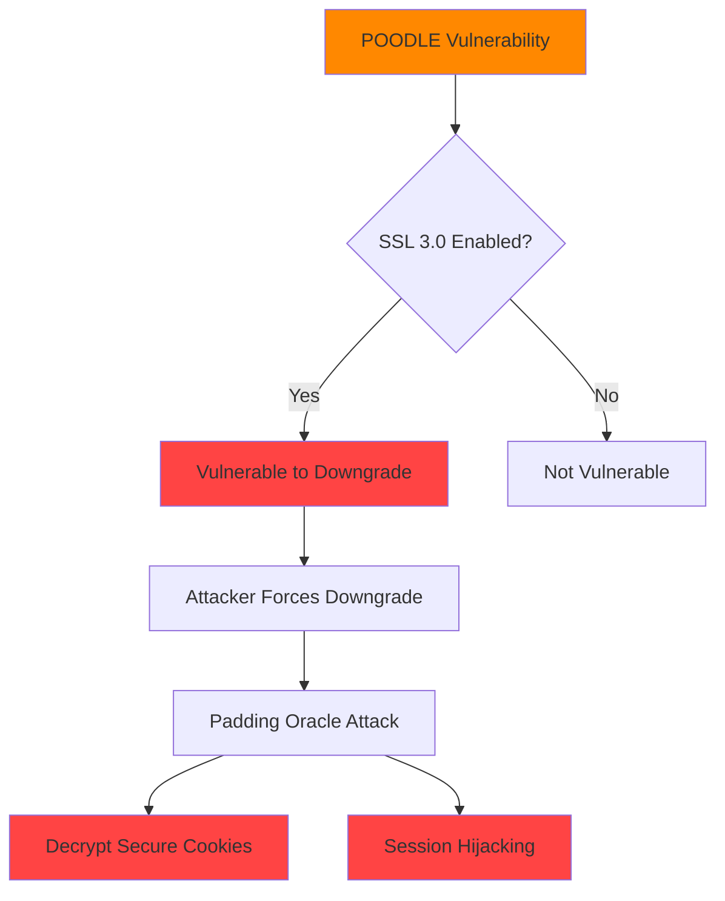

#### Mitigation
- Disable SSL 3.0 on all servers
- Enable TLS_FALLBACK_SCSV
- Use modern TLS versions (1.2+)
- Implement HTTP Strict Transport Security (HSTS)

#### References
- [NVD Entry](https://nvd.nist.gov/vuln/detail/CVE-2014-3566)
- [Google Security Blog](https://security.googleblog.com/2014/10/this-poodle-bites-exploiting-ssl-30.html)
- [POODLE Attack Paper](https://www.openssl.org/~bodo/ssl-poodle.pdf)

---

## 📈 2014 Vulnerability Landscape

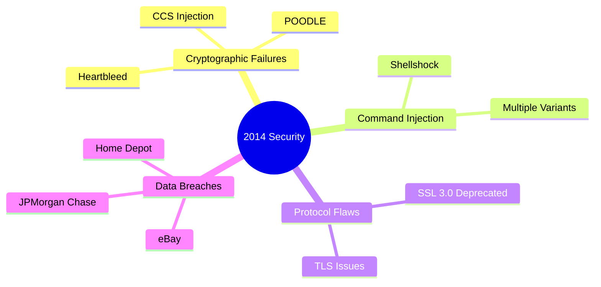

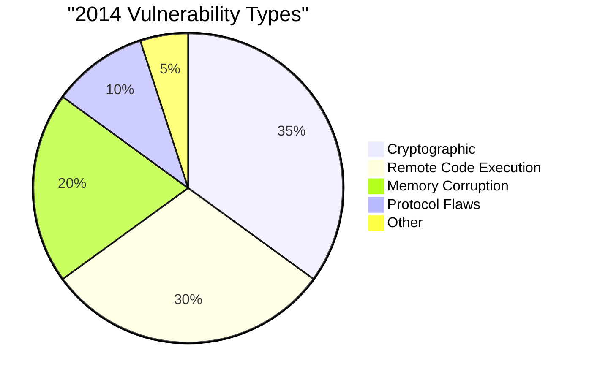

## 🏷️ Technology Tags Summary

- **OpenSSL**: 8+ critical CVEs
- **Bash**: 6 CVEs (Shellshock variants)
- **SSL/TLS Protocols**: 5 CVEs
- **Web Browsers**: 15+ CVEs
- **Microsoft Products**: 20+ CVEs

## 💡 Key Takeaways from 2014

1. **Ancient Bugs**: Both Heartbleed (2 years old) and Shellshock (25 years old) went undetected
2. **Universal Impact**: Vulnerabilities in foundational components affect everyone
3. **Protocol Security**: SSL 3.0 was 18 years old when POODLE forced its retirement
4. **Open Source Funding**: Heartbleed highlighted the need for better OSS security funding
5. **Responsible Disclosure**: Coordinated disclosure prevented even worse outcomes

## 📚 Additional Resources

- [Heartbleed Official Site](http://heartbleed.com/)
- [Shellshock Explained](https://www.troyhunt.com/everything-you-need-to-know-about/)
- [POODLE Technical Details](https://www.us-cert.gov/ncas/alerts/TA14-290A)
- [NVD 2014 Database](https://nvd.nist.gov/vuln/search/results?isCpeNameSearch=false&pub_start_date=01/01/2014&pub_end_date=12/31/2014)

---

**Note**: 2014 is remembered as the year that exposed critical flaws in the internet's security infrastructure, leading to significant improvements in security practices.
