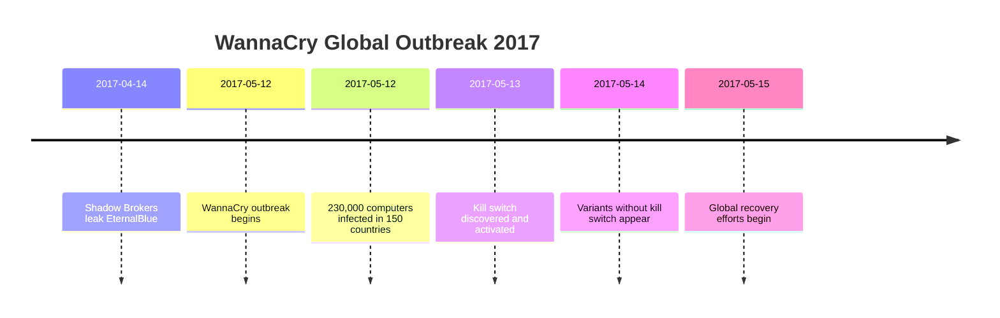
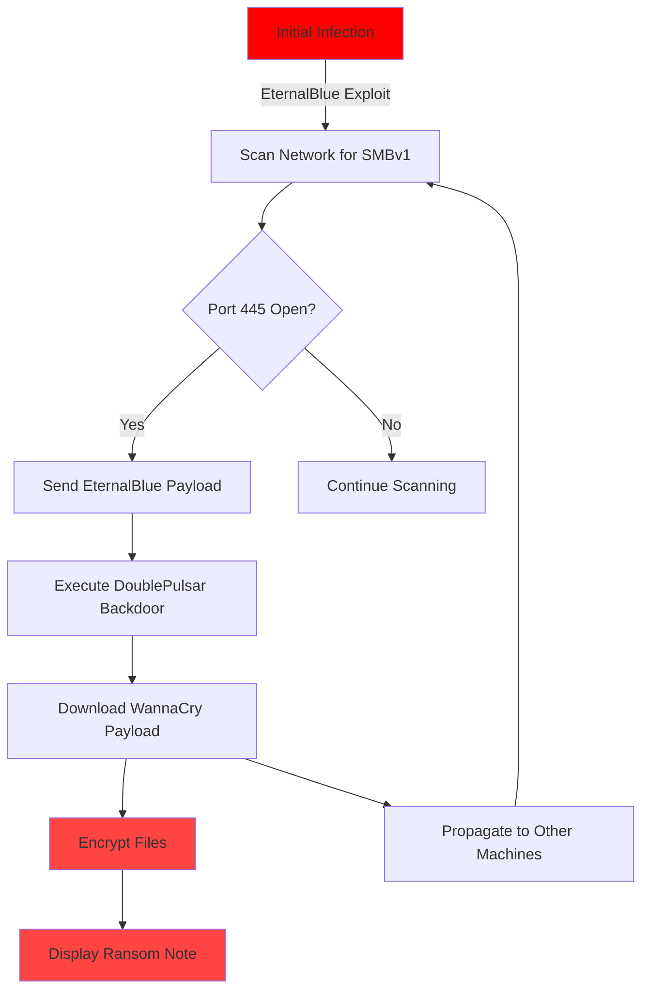
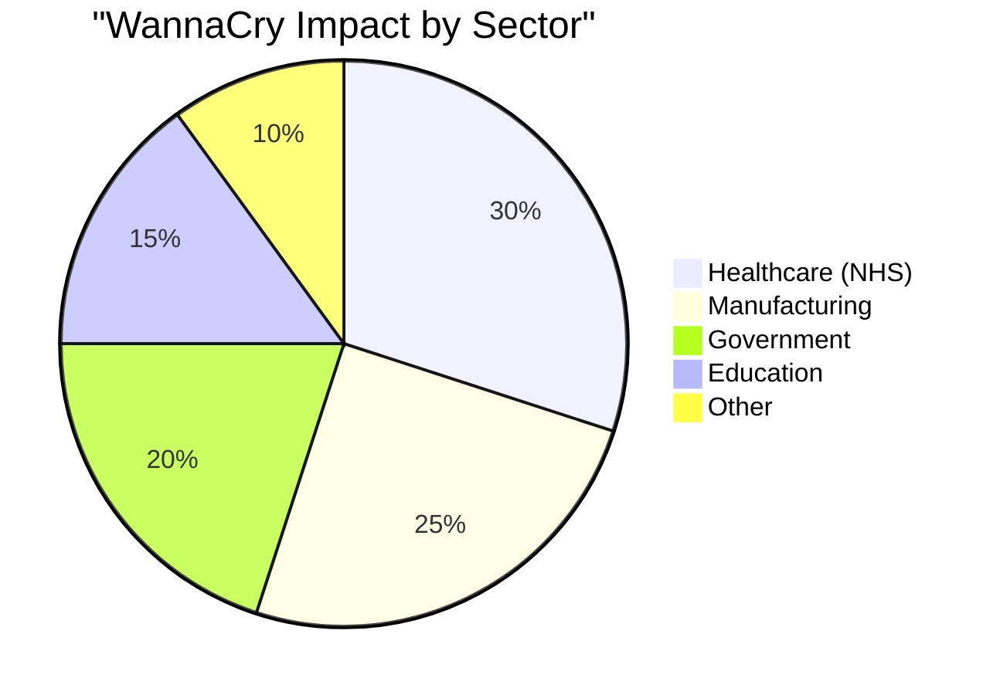
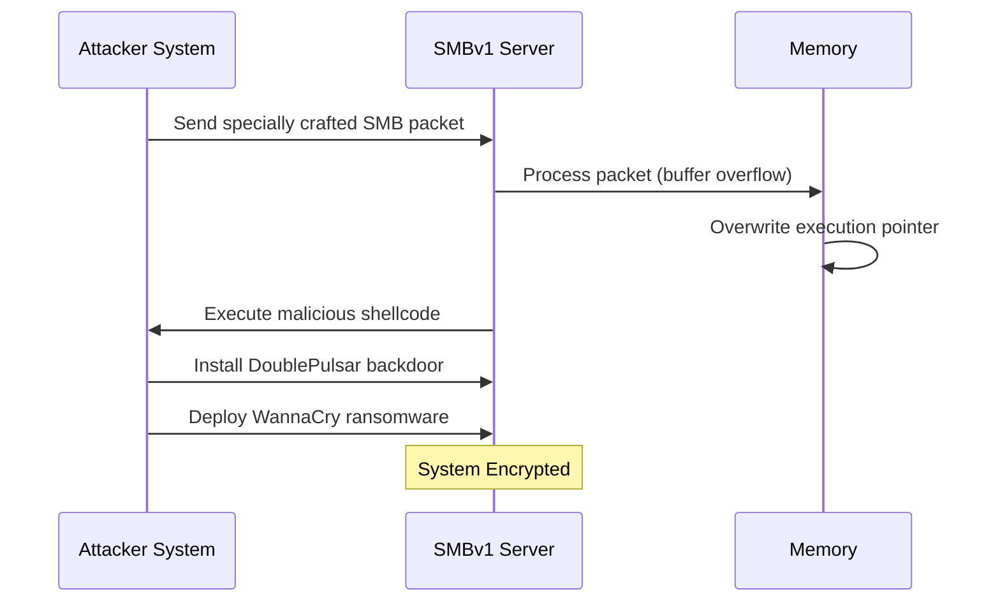
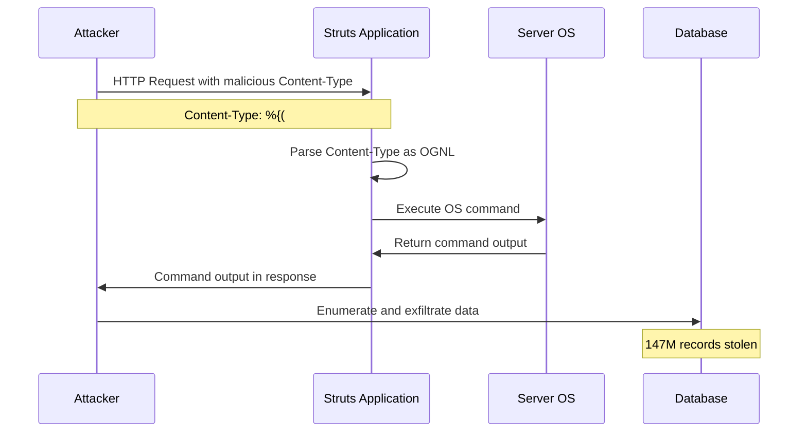
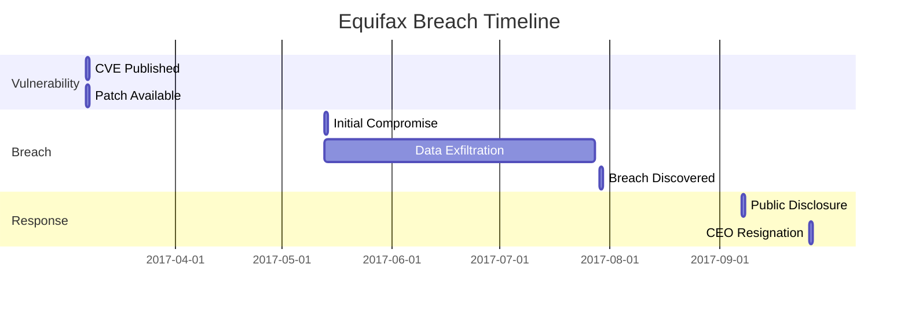
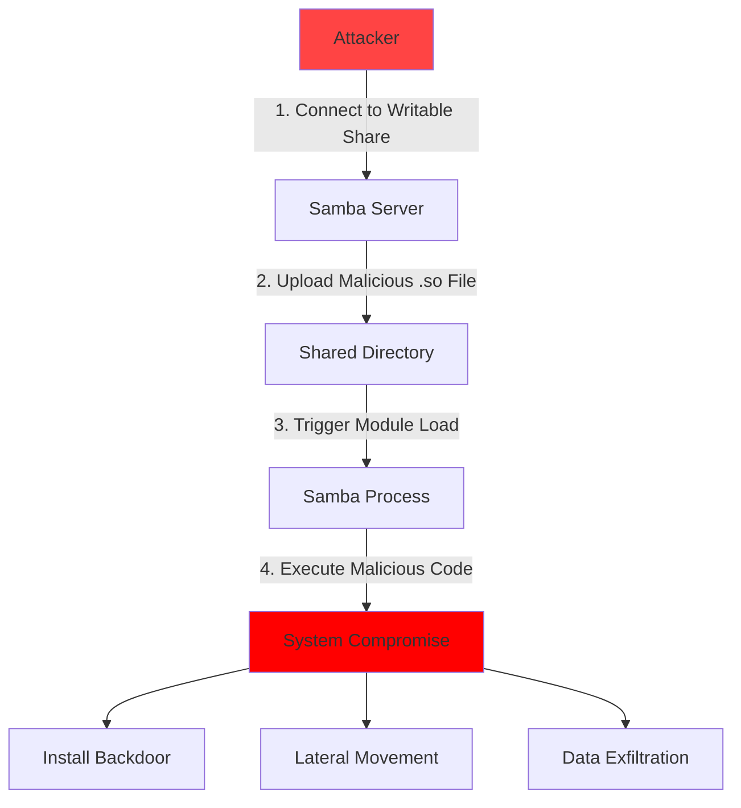
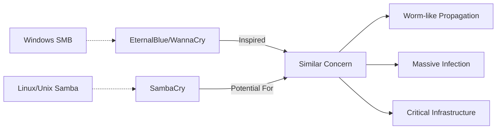
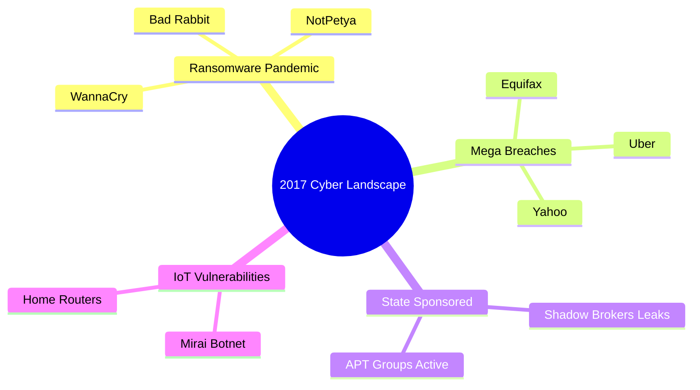
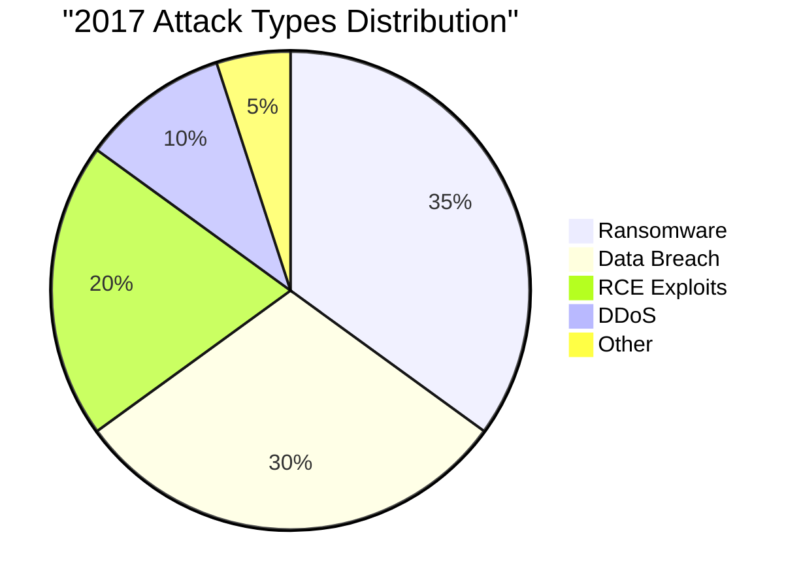

# CVE Analysis - 2017

## 📊 Overview

2017 was marked by some of the most widespread and damaging cyberattacks in history, including WannaCry and NotPetya ransomware, as well as the Equifax breach.

## 🔴 Critical Vulnerabilities (9.0 - 10.0)

| CVE ID | CVSS Score | Software/Service | Description | Tags |
|--------|------------|------------------|-------------|------|
| [CVE-2017-0144](https://nvd.nist.gov/vuln/detail/CVE-2017-0144) | 8.1 | Windows SMBv1 | EternalBlue - WannaCry | `Windows`, `SMB`, `Ransomware`, `RCE` |
| [CVE-2017-5638](https://nvd.nist.gov/vuln/detail/CVE-2017-5638) | 10.0 | Apache Struts 2 | RCE via Content-Type | `Java`, `Web Framework`, `Equifax Breach` |
| [CVE-2017-0199](https://nvd.nist.gov/vuln/detail/CVE-2017-0199) | 7.8 | Microsoft Office | HTA Handler RCE | `Microsoft`, `Office`, `RCE` |
| [CVE-2017-11882](https://nvd.nist.gov/vuln/detail/CVE-2017-11882) | 7.8 | Microsoft Office | Memory Corruption | `Microsoft`, `Office`, `Equation Editor` |
| [CVE-2017-10271](https://nvd.nist.gov/vuln/detail/CVE-2017-10271) | 7.5 | Oracle WebLogic | Deserialization RCE | `Oracle`, `WebLogic`, `Java` |

## 🟠 High Severity (7.0 - 8.9)

| CVE ID | CVSS Score | Software/Service | Description | Tags |
|--------|------------|------------------|-------------|------|
| [CVE-2017-0143](https://nvd.nist.gov/vuln/detail/CVE-2017-0143) | 8.1 | Windows SMBv1 | EternalBlue Variant | `Windows`, `SMB`, `RCE` |
| [CVE-2017-8464](https://nvd.nist.gov/vuln/detail/CVE-2017-8464) | 7.8 | Windows LNK | LNK File RCE | `Windows`, `USB`, `RCE` |
| [CVE-2017-7494](https://nvd.nist.gov/vuln/detail/CVE-2017-7494) | 10.0 | Samba | SambaCry RCE | `Linux`, `Samba`, `RCE` |
| [CVE-2017-0145](https://nvd.nist.gov/vuln/detail/CVE-2017-0145) | 8.1 | Windows SMBv1 | EternalBlue Chain | `Windows`, `SMB`, `RCE` |

## 🟡 Medium Severity (4.0 - 6.9)

| CVE ID | CVSS Score | Software/Service | Description | Tags |
|--------|------------|------------------|-------------|------|
| [CVE-2017-3066](https://nvd.nist.gov/vuln/detail/CVE-2017-3066) | 9.8 | Adobe ColdFusion | Java Deserialization | `Adobe`, `ColdFusion`, `RCE` |

## 🔍 Notable CVE Deep Dive

### CVE-2017-0144: EternalBlue / WannaCry (CRITICAL)

**CVSS Score**: 8.1  
**Affected Software**: Windows SMBv1 (Windows XP to Windows 10, Server 2003 to 2016)  
**Attack Vector**: Network  
**Impact**: Global Ransomware Pandemic

#### Description
EternalBlue is an exploit developed by the NSA and leaked by the Shadow Brokers group. It exploits a vulnerability in Microsoft's SMBv1 protocol, allowing remote code execution. WannaCry ransomware weaponized this exploit to create one of the most devastating cyberattacks in history.

#### WannaCry Attack Timeline

#### Attack Propagation

#### Global Impact

#### Notable Victims
- **UK National Health Service (NHS)**: 80 hospitals affected, surgeries cancelled
- **Renault**: Production halted at multiple plants
- **FedEx**: Operations disrupted
- **Deutsche Bahn**: Train station displays affected
- **Telefónica**: Spanish telecom giant hit

#### Technical Details

#### Mitigation
1. **Immediate Actions**:
   - Apply MS17-010 security patch
   - Disable SMBv1: `Disable-WindowsOptionalFeature -Online -FeatureName SMB1Protocol`
   - Block TCP ports 139 and 445 at firewall
   
2. **Long-term Actions**:
   - Implement network segmentation
   - Regular backup strategy
   - Update legacy systems
   - Security awareness training

#### References
- [NVD Entry](https://nvd.nist.gov/vuln/detail/CVE-2017-0144)
- [Microsoft Security Bulletin MS17-010](https://docs.microsoft.com/en-us/security-updates/securitybulletins/2017/ms17-010)
- [Malware Tech Kill Switch Analysis](https://www.malwaretech.com/2017/05/how-to-accidentally-stop-a-global-cyber-attacks.html)

---

### CVE-2017-5638: Apache Struts 2 / Equifax Breach

**CVSS Score**: 10.0  
**Affected Software**: Apache Struts 2.3.5 - 2.3.31, 2.5 - 2.5.10  
**Attack Vector**: Network  
**Impact**: One of the Largest Data Breaches in History

#### Description
Remote code execution vulnerability in Apache Struts 2 when using the Jakarta Multipart parser. Attackers can execute arbitrary commands by sending a malicious Content-Type header. This vulnerability was exploited to breach Equifax, exposing personal data of 147 million people.

#### Exploitation Mechanism

#### Equifax Breach Timeline

#### Data Compromised
- **147.9 million** US consumers
- **15.2 million** UK residents
- **19,000** Canadian residents

**Stolen Information**:
- Social Security Numbers
- Birth dates
- Addresses
- Driver's license numbers
- Credit card numbers (209,000 consumers)

#### Attack Flow

#### Consequences
- **$575 million** settlement with FTC
- **$1.4 billion** total breach cost
- CEO and CSO resignations
- Congressional hearings
- Major reputational damage

#### Mitigation
- Update to Struts 2.3.32 or 2.5.10.1 or later
- Implement WAF rules to block malicious Content-Type headers
- Regular vulnerability scanning
- Prompt patch management
- Network segmentation

#### References
- [NVD Entry](https://nvd.nist.gov/vuln/detail/CVE-2017-5638)
- [Apache Struts Advisory S2-045](https://cwiki.apache.org/confluence/display/WW/S2-045)
- [Equifax Congressional Report](https://www.hsgac.senate.gov/wp-content/uploads/imo/media/doc/HSGAC_Finance_Report_FINAL.pdf)

---

### CVE-2017-7494: SambaCry

**CVSS Score**: 10.0  
**Affected Software**: Samba 3.5.0 - 4.6.4/4.5.10/4.4.14  
**Attack Vector**: Network  
**Impact**: Remote Code Execution on Linux/Unix Systems

#### Description
Critical remote code execution vulnerability in Samba allowing attackers to upload a shared library to a writable share and execute arbitrary code on the server. Dubbed "SambaCry" due to similarities with WannaCry's propagation potential.

#### Vulnerability Mechanism

#### Affected Systems
- Linux file servers
- NAS devices
- Routers and embedded systems
- IoT devices running Samba

#### Impact Comparison

#### Mitigation
- Update Samba to versions 4.6.4, 4.5.10, or 4.4.14
- Disable loading of external libraries with: `nt pipe support = no`
- Implement firewall rules to restrict SMB access
- Use SELinux or AppArmor policies
- Regular security audits

#### References
- [NVD Entry](https://nvd.nist.gov/vuln/detail/CVE-2017-7494)
- [Samba Security Announcement](https://www.samba.org/samba/security/CVE-2017-7494.html)
- [Rapid7 Analysis](https://www.rapid7.com/blog/post/2017/05/24/r7-2017-10-samba-remote-code-execution-vulnerability-cve-2017-7494/)

---

## 📈 2017 Vulnerability Trends

## 🏷️ Technology Tags Summary

- **Windows**: 25+ CVEs (EternalBlue variants)
- **Java**: 15+ CVEs (Struts, WebLogic)
- **Linux/Unix**: 10 CVEs (Samba, etc.)
- **Microsoft Office**: 12 CVEs
- **Network Protocols**: 8 CVEs

## 💡 Lessons Learned from 2017

1. **Patch Management is Critical**: Equifax breach happened months after patch availability
2. **Legacy Systems are Dangerous**: WannaCry affected unsupported Windows XP systems
3. **Supply Chain Security**: NSA exploit leak showed government tool risks
4. **Worm Capabilities**: Modern malware can spread globally in hours
5. **Data Protection**: Even major corporations struggle with security basics

## 📚 Additional Resources

- [WannaCry Technical Analysis](https://www.fireeye.com/blog/threat-research/2017/05/wannacry-malware-profile.html)
- [Equifax Breach Investigation Report](https://www.hsgac.senate.gov/equifax-breach)
- [Shadow Brokers Timeline](https://en.wikipedia.org/wiki/The_Shadow_Brokers)
- [NVD 2017 Database](https://nvd.nist.gov/vuln/search/results?isCpeNameSearch=false&pub_start_date=01/01/2017&pub_end_date=12/31/2017)

---

**Note**: 2017 marked a turning point in cybersecurity awareness, with WannaCry and Equifax demonstrating the real-world impact of unpatched vulnerabilities.
