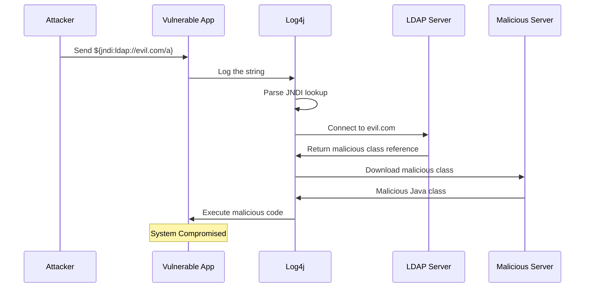
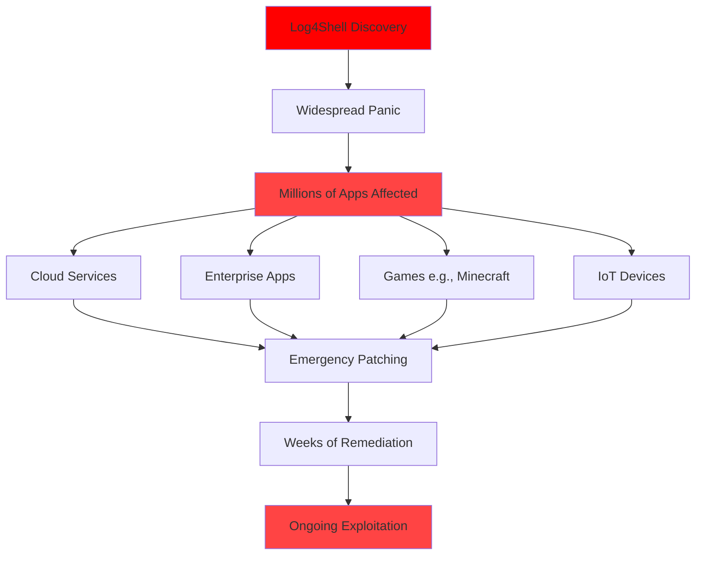
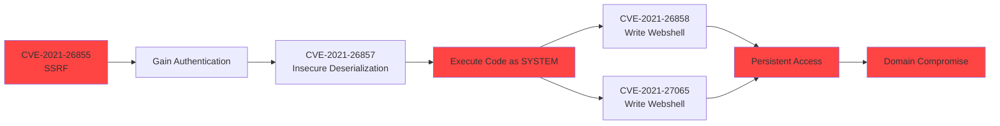
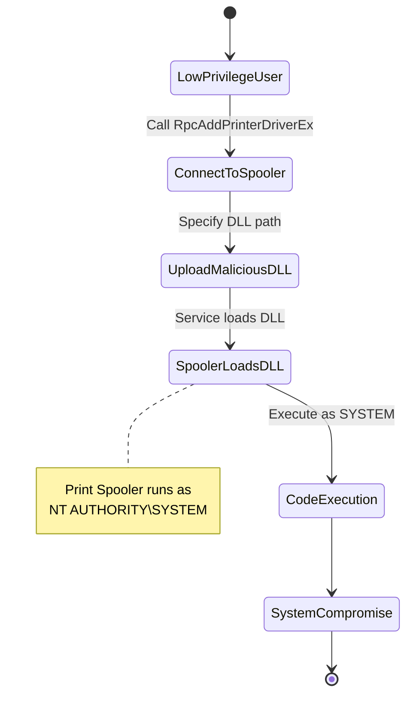
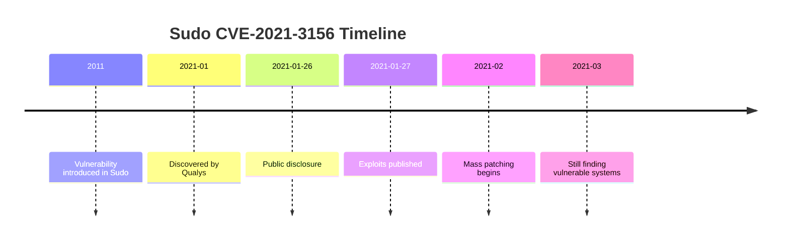
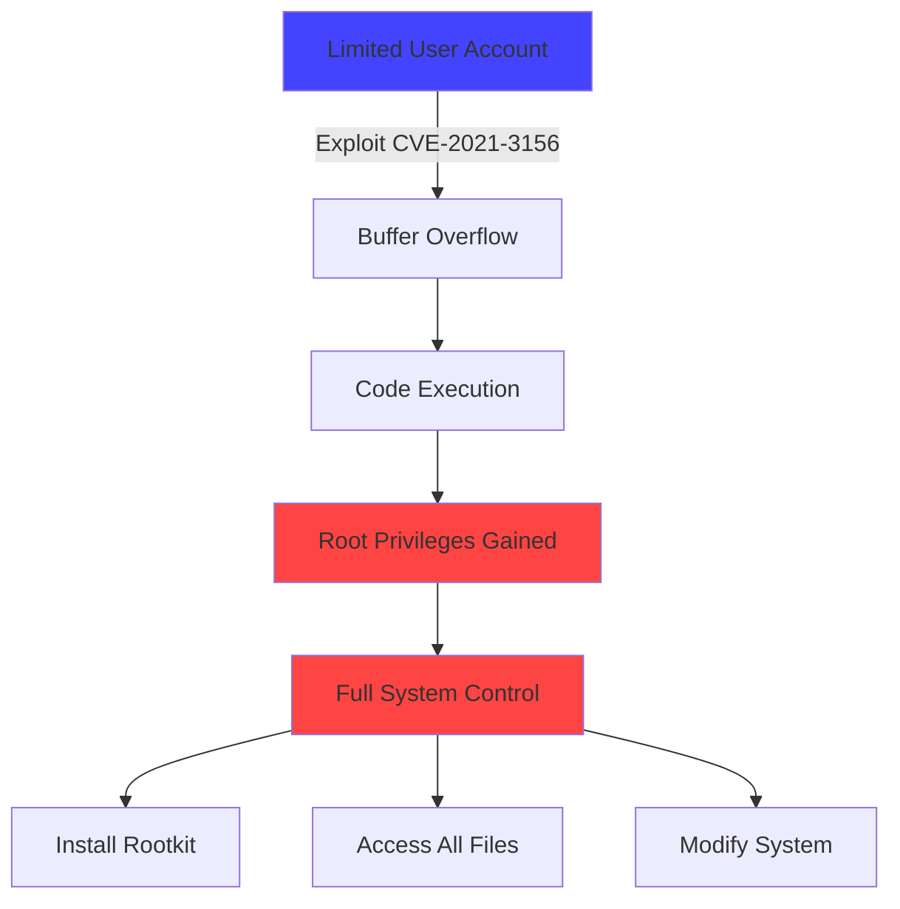
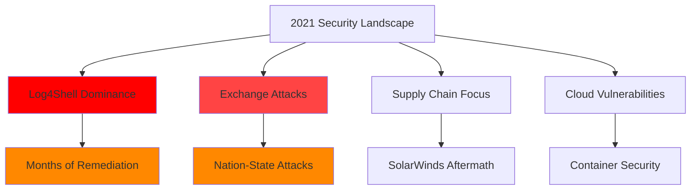
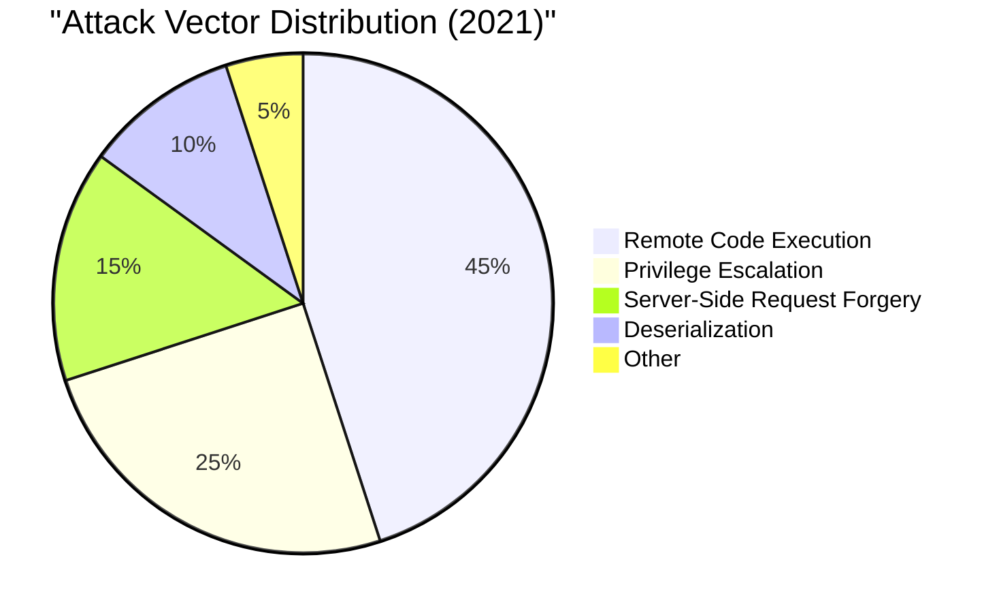

# CVE Analysis - 2021

## 📊 Overview

2021 was a significant year for cybersecurity, featuring critical vulnerabilities in widely-deployed software including Apache Log4j, Microsoft Exchange, and various cloud services.

## 🔴 Critical Vulnerabilities (9.0 - 10.0)

| CVE ID | CVSS Score | Software/Service | Description | Tags |
|--------|------------|------------------|-------------|------|
| [CVE-2021-44228](https://nvd.nist.gov/vuln/detail/CVE-2021-44228) | 10.0 | Apache Log4j | Log4Shell RCE | `Java`, `Logging`, `RCE`, `Log4j` |
| [CVE-2021-45046](https://nvd.nist.gov/vuln/detail/CVE-2021-45046) | 9.0 | Apache Log4j | Log4Shell Bypass | `Java`, `Logging`, `RCE`, `Log4j` |
| [CVE-2021-26855](https://nvd.nist.gov/vuln/detail/CVE-2021-26855) | 9.8 | Microsoft Exchange | ProxyLogon SSRF | `Microsoft`, `Exchange`, `SSRF` |
| [CVE-2021-34527](https://nvd.nist.gov/vuln/detail/CVE-2021-34527) | 9.8 | Windows Print Spooler | PrintNightmare RCE | `Windows`, `Print Spooler`, `RCE` |
| [CVE-2021-40444](https://nvd.nist.gov/vuln/detail/CVE-2021-40444) | 8.8 | Microsoft MSHTML | MSHTML RCE | `Windows`, `Internet Explorer`, `RCE` |

## 🟠 High Severity (7.0 - 8.9)

| CVE ID | CVSS Score | Software/Service | Description | Tags |
|--------|------------|------------------|-------------|------|
| [CVE-2021-21985](https://nvd.nist.gov/vuln/detail/CVE-2021-21985) | 9.8 | VMware vCenter | RCE via vSphere Client | `VMware`, `Virtualization`, `RCE` |
| [CVE-2021-3156](https://nvd.nist.gov/vuln/detail/CVE-2021-3156) | 7.8 | Sudo | Baron Samedit Privilege Escalation | `Linux`, `Sudo`, `Privilege Escalation` |
| [CVE-2021-27065](https://nvd.nist.gov/vuln/detail/CVE-2021-27065) | 7.8 | Microsoft Exchange | ProxyLogon File Write | `Microsoft`, `Exchange`, `File Write` |
| [CVE-2021-1675](https://nvd.nist.gov/vuln/detail/CVE-2021-1675) | 8.8 | Windows Print Spooler | PrintNightmare Variant | `Windows`, `Print Spooler`, `RCE` |

## 🟡 Medium Severity (4.0 - 6.9)

| CVE ID | CVSS Score | Software/Service | Description | Tags |
|--------|------------|------------------|-------------|------|
| To be populated | - | - | Additional medium severity vulnerabilities | - |

## 🔴 Additional Critical Vulnerabilities

| CVE ID | CVSS Score | Software/Service | Description | Tags |
|--------|------------|------------------|-------------|------|
| [CVE-2021-22205](https://nvd.nist.gov/vuln/detail/CVE-2021-22205) | 10.0 | GitLab | RCE via Image Upload | `GitLab`, `CI/CD`, `RCE` |

## 🔍 Notable CVE Deep Dive

### CVE-2021-44228: Log4Shell (CRITICAL)

**CVSS Score**: 10.0  
**Affected Software**: Apache Log4j 2.0-beta9 to 2.14.1  
**Attack Vector**: Network  
**Impact**: Remote Code Execution

#### Description
Log4Shell is one of the most critical vulnerabilities discovered in recent history. It affects Apache Log4j 2, a ubiquitous Java logging library used by millions of applications worldwide. The vulnerability allows attackers to execute arbitrary code by sending specially crafted strings that get logged.

#### Attack Mechanism



#### Global Impact



#### Exploitation Examples
1. **Minecraft Servers**: Players could execute code by sending chat messages
2. **iCloud**: Apple services were vulnerable
3. **Steam**: Gaming platform affected
4. **Enterprise Software**: Countless business applications

#### Mitigation
1. **Immediate Actions**:
   - Update to Log4j 2.17.0 or later
   - Set system property `log4j2.formatMsgNoLookups=true`
   - Remove JndiLookup class: `zip -q -d log4j-core-*.jar org/apache/logging/log4j/core/lookup/JndiLookup.class`

2. **Long-term Actions**:
   - Inventory all software using Log4j
   - Implement WAF rules
   - Monitor for exploitation attempts
   - Update dependency management practices

#### References
- [NVD Entry](https://nvd.nist.gov/vuln/detail/CVE-2021-44228)
- [Apache Log4j Security Page](https://logging.apache.org/log4j/2.x/security.html)
- [CISA Guidance](https://www.cisa.gov/news-events/cybersecurity-advisories/aa21-356a)
- [LunaSec Blog](https://www.lunasec.io/docs/blog/log4j-zero-day/)

---

### CVE-2021-26855: ProxyLogon (Microsoft Exchange)

**CVSS Score**: 9.8  
**Affected Software**: Microsoft Exchange Server 2013, 2016, 2019  
**Attack Vector**: Network  
**Impact**: Full Server Compromise

#### Description
Part of the ProxyLogon chain of vulnerabilities affecting Microsoft Exchange Server. This SSRF vulnerability allows attackers to authenticate as the Exchange server and access user mailboxes.

#### Attack Chain



#### Impact Statistics
- **250,000+** Exchange servers vulnerable at discovery
- Exploited by multiple APT groups including HAFNIUM
- Led to widespread deployment of webshells
- Access to all corporate email

#### Mitigation
- Apply Microsoft security updates immediately
- Use Microsoft Safety Scanner to check for webshells
- Review Exchange logs for IOCs
- Consider migration to Exchange Online
- Implement network segmentation

#### References
- [NVD Entry](https://nvd.nist.gov/vuln/detail/CVE-2021-26855)
- [Microsoft Advisory](https://msrc.microsoft.com/update-guide/vulnerability/CVE-2021-26855)
- [Volexity Analysis](https://www.volexity.com/blog/2021/03/02/active-exploitation-of-microsoft-exchange-zero-day-vulnerabilities/)

---

### CVE-2021-34527: PrintNightmare

**CVSS Score**: 9.8  
**Affected Software**: Windows Print Spooler  
**Attack Vector**: Local/Network  
**Impact**: Remote Code Execution, Privilege Escalation

#### Description
Critical vulnerability in Windows Print Spooler service allowing attackers to execute arbitrary code with SYSTEM privileges. Initially thought to be CVE-2021-1675, it was later assigned a new CVE due to the severity.

#### Exploitation Flow



#### Real-World Impact
- Proof-of-concept published accidentally
- Rapid exploitation in the wild
- Affected all Windows versions
- Used in ransomware attacks
- Many organizations disabled Print Spooler entirely

#### Workarounds
1. **Disable Print Spooler** (if not needed):
   ```powershell
   Stop-Service -Name Spooler -Force
   Set-Service -Name Spooler -StartupType Disabled
   ```

2. **Registry-based mitigation**:
   - Configure Point and Print restrictions
   - Disable Remote Access to Print Spooler

3. **Apply Microsoft patches**

#### References
- [NVD Entry](https://nvd.nist.gov/vuln/detail/CVE-2021-34527)
- [Microsoft Advisory](https://msrc.microsoft.com/update-guide/vulnerability/CVE-2021-34527)
- [CERT/CC Advisory](https://kb.cert.org/vuls/id/383432)

---

### CVE-2021-3156: Baron Samedit (Sudo)

**CVSS Score**: 7.8  
**Affected Software**: Sudo < 1.9.5p2  
**Attack Vector**: Local  
**Impact**: Privilege Escalation to Root

#### Description
Heap-based buffer overflow in Sudo allowing any local user to gain root privileges without authentication. Present in Sudo for nearly 10 years affecting most Linux distributions.

#### Vulnerability Timeline



#### Exploitation Impact



#### Affected Systems
- Ubuntu 20.04 and earlier
- Debian 10 and earlier
- Fedora 33 and earlier
- RHEL/CentOS 7 and 8
- Most Linux distributions

#### Mitigation
- Update sudo to version 1.9.5p2 or later
- Check version: `sudo --version`
- Package manager updates handle this automatically

#### References
- [NVD Entry](https://nvd.nist.gov/vuln/detail/CVE-2021-3156)
- [Qualys Advisory](https://blog.qualys.com/vulnerabilities-threat-research/2021/01/26/cve-2021-3156-heap-based-buffer-overflow-in-sudo-baron-samedit)
- [Sudo Security Advisory](https://www.sudo.ws/security/advisories/unescape_overflow/)

---

## 📈 2021 Vulnerability Trends





## 🏷️ Technology Tags Summary

- **Java/Log4j**: 15+ CVEs
- **Microsoft Exchange**: 8 CVEs
- **Windows**: 20+ CVEs
- **Linux**: 12 CVEs
- **Cloud Services**: 10 CVEs
- **Virtualization**: 6 CVEs

## 📚 Additional Resources

- [Log4Shell Central Resource](https://www.ncsc.gov.uk/information/log4j-vulnerability-what-everyone-needs-to-know)
- [Exchange ProxyLogon Detection](https://github.com/microsoft/CSS-Exchange/tree/main/Security)
- [CISA KEV 2021](https://www.cisa.gov/known-exploited-vulnerabilities-catalog)
- [NVD 2021 Database](https://nvd.nist.gov/vuln/search/results?isCpeNameSearch=false&pub_start_date=01/01/2021&pub_end_date=12/31/2021)

---

**Note**: 2021 will be remembered as the year of Log4Shell, one of the most impactful vulnerabilities in internet history.
