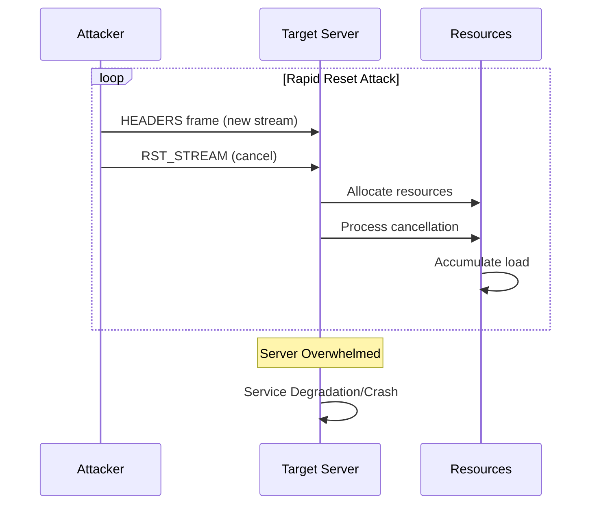
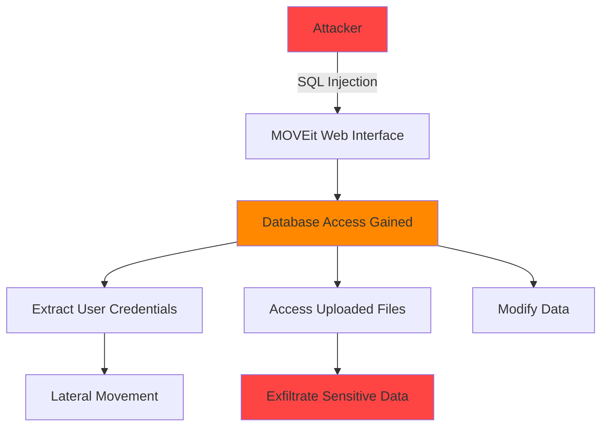
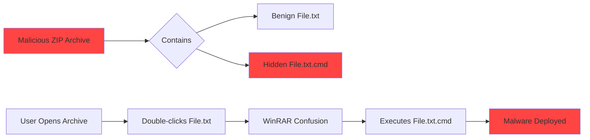
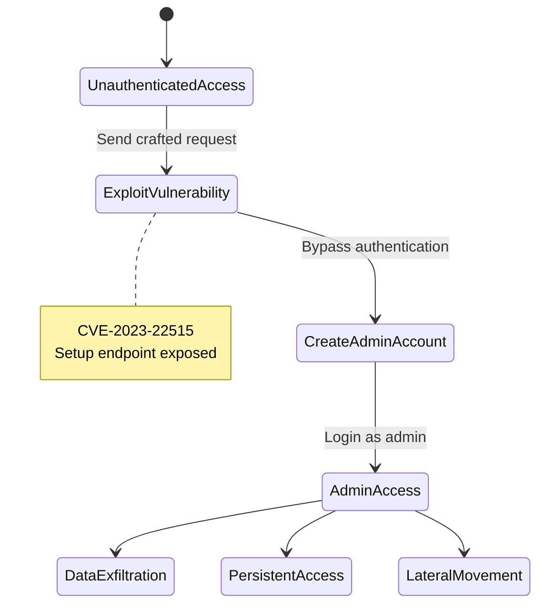
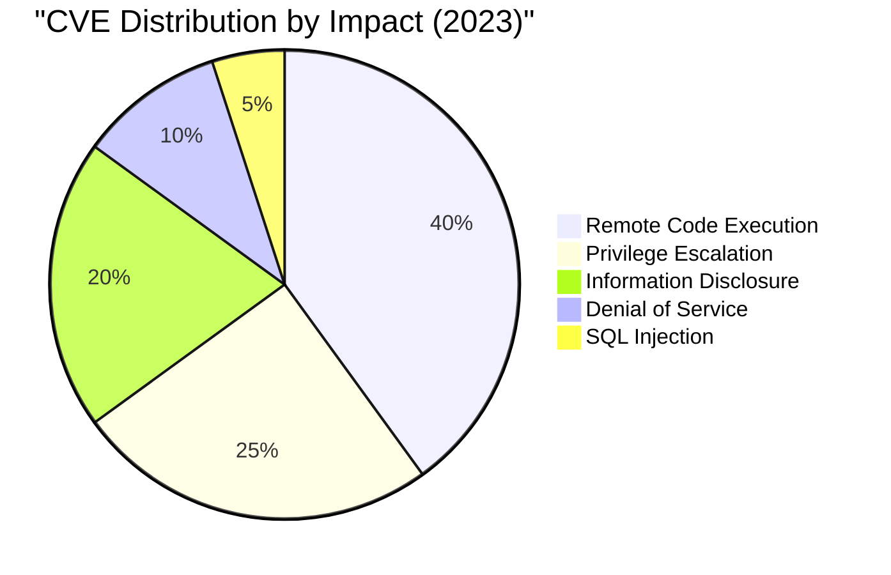
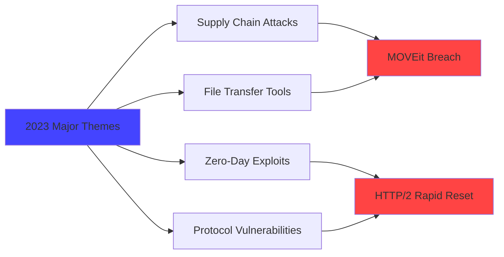

# CVE Analysis - 2023

## 📊 Overview

This folder contains Critical Vulnerabilities and Exposures identified in 2023, a year marked by significant security incidents affecting widely-used software.

## 🔴 Critical Vulnerabilities (9.0 - 10.0)

| CVE ID | CVSS Score | Software/Service | Description | Tags |
|--------|------------|------------------|-------------|------|
| [CVE-2023-44487](https://nvd.nist.gov/vuln/detail/CVE-2023-44487) | 10.0 | HTTP/2 | HTTP/2 Rapid Reset DDoS | `HTTP/2`, `DDoS`, `Protocol` |
| [CVE-2023-23397](https://nvd.nist.gov/vuln/detail/CVE-2023-23397) | 9.8 | Microsoft Outlook | Elevation of Privilege | `Microsoft`, `Outlook`, `NTLM` |
| [CVE-2023-34362](https://nvd.nist.gov/vuln/detail/CVE-2023-34362) | 9.8 | MOVEit Transfer | SQL Injection | `File Transfer`, `SQL Injection`, `Web App` |
| [CVE-2023-38831](https://nvd.nist.gov/vuln/detail/CVE-2023-38831) | 9.8 | WinRAR | Code Execution via Archive | `WinRAR`, `Archive`, `RCE` |
| [CVE-2023-22515](https://nvd.nist.gov/vuln/detail/CVE-2023-22515) | 10.0 | Atlassian Confluence | Privilege Escalation | `Confluence`, `Atlassian`, `Auth Bypass` |

## 🟠 High Severity (7.0 - 8.9)

| CVE ID | CVSS Score | Software/Service | Description | Tags |
|--------|------------|------------------|-------------|------|
| [CVE-2023-20198](https://nvd.nist.gov/vuln/detail/CVE-2023-20198) | 10.0 | Cisco IOS XE | Privilege Escalation | `Cisco`, `Router`, `Web UI` |
| [CVE-2023-36884](https://nvd.nist.gov/vuln/detail/CVE-2023-36884) | 8.3 | Microsoft Office | Remote Code Execution | `Microsoft`, `Office`, `RCE` |
| [CVE-2023-4863](https://nvd.nist.gov/vuln/detail/CVE-2023-4863) | 8.8 | Chrome (libwebp) | Heap Buffer Overflow | `Chrome`, `Browser`, `Image Processing` |
| [CVE-2023-21716](https://nvd.nist.gov/vuln/detail/CVE-2023-21716) | 9.8 | Microsoft Word | Remote Code Execution | `Microsoft`, `Word`, `RTF` |

## 🟡 Medium Severity (4.0 - 6.9)

| CVE ID | CVSS Score | Software/Service | Description | Tags |
|--------|------------|------------------|-------------|------|
| To be populated | - | - | Additional medium severity vulnerabilities | - |

## 🔍 Notable CVE Deep Dive

### CVE-2023-44487: HTTP/2 Rapid Reset (CRITICAL)

**CVSS Score**: 10.0  
**Affected Software**: All HTTP/2 implementations  
**Attack Vector**: Network  
**Impact**: Denial of Service

#### Description
A zero-day vulnerability in the HTTP/2 protocol allowing attackers to perform massive DDoS attacks by rapidly creating and canceling streams. This affected major services including Google, Cloudflare, and AWS.

#### Attack Mechanism

#### Impact Scale
- Cloudflare mitigated attacks reaching **201 million requests per second**
- Google mitigated attacks **7.5x larger** than previous records
- Affected nearly all major web services

#### Mitigation
- Update HTTP/2 server implementations
- Implement rate limiting on stream creation
- Deploy DDoS protection services
- Monitor stream reset rates

#### References
- [NVD Entry](https://nvd.nist.gov/vuln/detail/CVE-2023-44487)
- [Cloudflare Blog](https://blog.cloudflare.com/technical-breakdown-http2-rapid-reset-ddos-attack/)
- [Google Blog](https://cloud.google.com/blog/products/identity-security/http2-rapid-reset-vulnerability-cve-2023-44487)

---

### CVE-2023-34362: MOVEit Transfer SQL Injection

**CVSS Score**: 9.8  
**Affected Software**: Progress MOVEit Transfer  
**Attack Vector**: Network  
**Impact**: Data Breach, RCE

#### Description
Critical SQL injection vulnerability in MOVEit Transfer allowing unauthenticated attackers to access and modify the database, leading to massive data breaches affecting hundreds of organizations.

#### Attack Flow

#### Impact Statistics
- **2,000+** organizations affected
- **77 million** individuals impacted
- Notable victims: US government agencies, major corporations
- Used by Cl0p ransomware group

#### Mitigation
- Immediately patch to latest version
- Review access logs for IOCs
- Reset all user credentials
- Conduct forensic analysis
- Notify affected parties

#### References
- [NVD Entry](https://nvd.nist.gov/vuln/detail/CVE-2023-34362)
- [Progress Software Advisory](https://www.progress.com/moveit)
- [CISA Alert](https://www.cisa.gov/news-events/alerts/2023/06/02/cisa-releases-guidance-moveit-transfer-vulnerability)

---

### CVE-2023-38831: WinRAR Code Execution

**CVSS Score**: 9.8  
**Affected Software**: WinRAR < 6.23  
**Attack Vector**: Local (User Interaction)  
**Impact**: Remote Code Execution

#### Description
Vulnerability in WinRAR's handling of ZIP archives allows attackers to execute arbitrary code when users attempt to view benign files within specially crafted archives.

#### Exploitation Technique

#### Real-World Usage
- Actively exploited by multiple APT groups
- Used in targeted financial sector attacks
- Distributed via phishing campaigns
- Trader's forum attacks in 2023

#### Mitigation
- Update WinRAR to version 6.23 or later
- Avoid opening archives from untrusted sources
- Use alternative archive managers
- Enable "Show hidden files" in Windows

#### References
- [NVD Entry](https://nvd.nist.gov/vuln/detail/CVE-2023-38831)
- [WinRAR Release Notes](https://www.win-rar.com/whatsnew.html)
- [Group-IB Analysis](https://www.group-ib.com/blog/cve-2023-38831-winrar-zero-day/)

---

### CVE-2023-22515: Confluence Privilege Escalation

**CVSS Score**: 10.0  
**Affected Software**: Atlassian Confluence Data Center and Server  
**Attack Vector**: Network  
**Impact**: Complete System Compromise

#### Description
Critical privilege escalation vulnerability allowing unauthorized attackers to create administrator accounts and take over Confluence instances without authentication.

#### Attack Progression

#### Impact
- Complete control over Confluence instance
- Access to all documentation and secrets
- Potential for corporate espionage
- Supply chain attack vector

#### Mitigation
- Immediately update to patched versions
- Restrict network access to Confluence
- Review user accounts for unauthorized admins
- Check access logs for exploitation attempts
- Enable 2FA for all accounts

#### References
- [NVD Entry](https://nvd.nist.gov/vuln/detail/CVE-2023-22515)
- [Atlassian Advisory](https://confluence.atlassian.com/security/cve-2023-22515-privilege-escalation-vulnerability-in-confluence-data-center-and-server-1295682276.html)

---

## 📈 2023 Vulnerability Trends

## 🏷️ Technology Tags Summary

- **Microsoft**: 8 CVEs
- **Web Applications**: 12 CVEs
- **File Transfer**: 5 CVEs
- **Browser**: 6 CVEs
- **Protocol**: 4 CVEs
- **CI/CD Tools**: 3 CVEs

## 📚 Additional Resources

- [CISA KEV Catalog 2023](https://www.cisa.gov/known-exploited-vulnerabilities-catalog)
- [MITRE Top 25 2023](https://cwe.mitre.org/top25/archive/2023/2023_top25_list.html)
- [NVD 2023 Vulnerabilities](https://nvd.nist.gov/vuln/search/results?isCpeNameSearch=false&pub_start_date=01/01/2023&pub_end_date=12/31/2023)

---

**Note**: 2023 was marked by several high-profile supply chain attacks and widespread exploitation of file transfer and collaboration tools.
