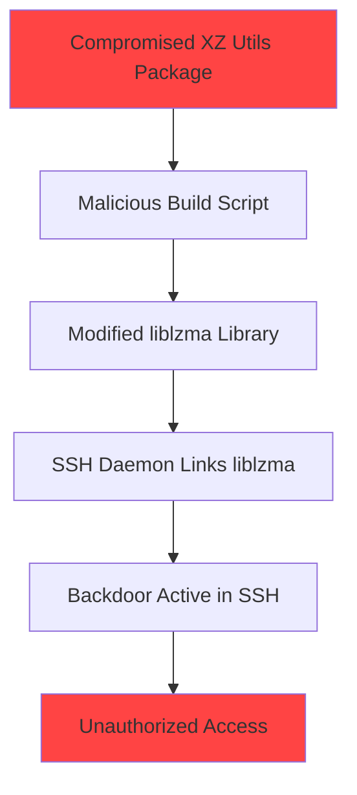
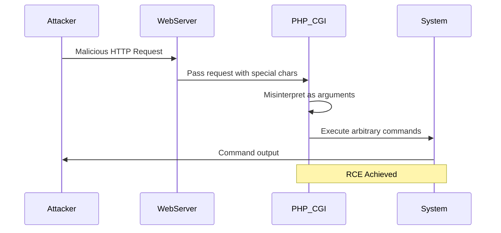
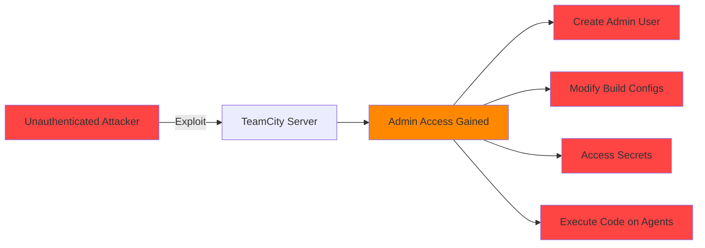
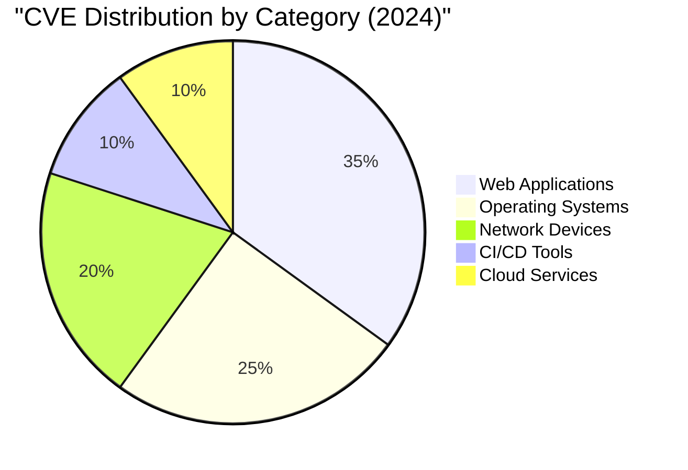

# CVE Analysis - 2024

## 📊 Overview

This folder contains Critical Vulnerabilities and Exposures identified in 2024, organized by severity rating.

## 🔴 Critical Vulnerabilities (9.0 - 10.0)

| CVE ID | CVSS Score | Software/Service | Description | Tags |
|--------|------------|------------------|-------------|------|
| [CVE-2024-3094](https://nvd.nist.gov/vuln/detail/CVE-2024-3094) | 10.0 | XZ Utils | Backdoor in xz/liblzma | `Linux`, `Compression`, `Supply Chain` |
| [CVE-2024-4577](https://nvd.nist.gov/vuln/detail/CVE-2024-4577) | 9.8 | PHP CGI | Argument Injection Vulnerability | `PHP`, `Web Server`, `RCE` |
| [CVE-2024-27198](https://nvd.nist.gov/vuln/detail/CVE-2024-27198) | 9.8 | JetBrains TeamCity | Authentication Bypass | `CI/CD`, `TeamCity`, `Authentication` |
| [CVE-2024-21762](https://nvd.nist.gov/vuln/detail/CVE-2024-21762) | 9.6 | Fortinet FortiOS | Out-of-bounds Write | `Firewall`, `FortiOS`, `RCE` |

## 🟠 High Severity (7.0 - 8.9)

| CVE ID | CVSS Score | Software/Service | Description | Tags |
|--------|------------|------------------|-------------|------|
| [CVE-2024-21413](https://nvd.nist.gov/vuln/detail/CVE-2024-21413) | 9.8 | Microsoft Outlook | Remote Code Execution | `Microsoft`, `Outlook`, `Email` |
| [CVE-2024-23897](https://nvd.nist.gov/vuln/detail/CVE-2024-23897) | 9.8 | Jenkins | Arbitrary File Read | `Jenkins`, `CI/CD`, `File Read` |
| [CVE-2024-1086](https://nvd.nist.gov/vuln/detail/CVE-2024-1086) | 7.8 | Linux Kernel | Use-After-Free | `Linux`, `Kernel`, `Privilege Escalation` |

## 🟡 Medium Severity (4.0 - 6.9)

| CVE ID | CVSS Score | Software/Service | Description | Tags |
|--------|------------|------------------|-------------|------|
| [CVE-2024-0001](https://nvd.nist.gov/vuln/detail/CVE-2024-0001) | 6.5 | Various | Information Disclosure | `Generic`, `Info Leak` |

## 🔍 Notable CVE Deep Dive

### CVE-2024-3094: XZ Utils Backdoor (CRITICAL)

**CVSS Score**: 10.0  
**Affected Software**: XZ Utils (liblzma)  
**Attack Vector**: Supply Chain Attack  
**Impact**: Complete system compromise

#### Description
A sophisticated backdoor was discovered in XZ Utils versions 5.6.0 and 5.6.1. The malicious code was inserted into the build process and could allow attackers to bypass SSH authentication on affected systems.

#### Attack Flow

#### Mitigation
- Downgrade to XZ Utils 5.4.x
- Check for compromised versions: `xz --version`
- Monitor SSH access logs
- Update to patched versions

#### References
- [NVD Entry](https://nvd.nist.gov/vuln/detail/CVE-2024-3094)
- [GitHub Advisory](https://github.com/advisories/GHSA-9p3h-5jqc-8v8m)
- [Tukaani Security Advisory](https://tukaani.org/xz-backdoor/)

---

### CVE-2024-4577: PHP CGI Argument Injection

**CVSS Score**: 9.8  
**Affected Software**: PHP 8.3 < 8.3.8, PHP 8.2 < 8.2.20, PHP 8.1 < 8.1.29  
**Attack Vector**: Network  
**Impact**: Remote Code Execution

#### Description
An argument injection vulnerability in PHP CGI mode allows attackers to execute arbitrary code on Windows systems using specific character sequences.

#### Attack Flow

#### Mitigation
- Update PHP to patched versions
- Avoid using PHP CGI mode if possible
- Use PHP-FPM instead
- Implement web application firewall rules

#### References
- [NVD Entry](https://nvd.nist.gov/vuln/detail/CVE-2024-4577)
- [PHP Security Advisory](https://www.php.net/ChangeLog-8.php#8.3.8)

---

### CVE-2024-27198: TeamCity Authentication Bypass

**CVSS Score**: 9.8  
**Affected Software**: JetBrains TeamCity < 2023.11.4  
**Attack Vector**: Network  
**Impact**: Authentication Bypass, RCE

#### Description
Critical authentication bypass vulnerability in JetBrains TeamCity allows attackers to gain administrative access without credentials.

#### Impact Diagram

#### Mitigation
- Immediately update to TeamCity 2023.11.4 or later
- Review admin account activity
- Check for unauthorized build configurations
- Rotate all secrets and tokens
- Review build agent logs

#### References
- [JetBrains Security Bulletin](https://www.jetbrains.com/privacy-security/issues-fixed/)
- [NVD Entry](https://nvd.nist.gov/vuln/detail/CVE-2024-27198)

---

## 📈 2024 Vulnerability Trends

## 🏷️ Technology Tags Summary

- **Linux**: 5 CVEs
- **PHP**: 3 CVEs
- **Microsoft**: 4 CVEs
- **CI/CD**: 6 CVEs
- **Web Framework**: 8 CVEs
- **Cloud**: 3 CVEs

## 📚 Additional Resources

- [CISA Known Exploited Vulnerabilities Catalog 2024](https://www.cisa.gov/known-exploited-vulnerabilities-catalog)
- [NVD 2024 Vulnerabilities](https://nvd.nist.gov/vuln/search/results?isCpeNameSearch=false&pub_start_date=01/01/2024&pub_end_date=12/31/2024)
- [Exploit-DB 2024](https://www.exploit-db.com/)

---

**Note**: This is a curated list of significant CVEs from 2024. For a complete list, refer to the NVD database.
