# CVE Analysis - 2025

## 📊 Overview

This folder contains Critical Vulnerabilities and Exposures identified in 2025, with a focus on emerging threats in modern web frameworks and server-side JavaScript.

## 🔴 Critical Vulnerabilities (9.0 - 10.0)

| CVE ID | CVSS Score | Software/Service | Description | Tags |
|--------|------------|------------------|-------------|------|
| [CVE-2025-55182](#cve-2025-55182-nextjs-server-actions-rce) | 9.8 | Next.js | Server Actions Remote Code Execution via Prototype Pollution | `Next.js`, `React`, `RCE`, `Prototype Pollution` |
| [CVE-2025-55183](#cve-2025-55183-nextjs-server-actions-code-injection) | 9.8 | Next.js | Server Actions Arbitrary Code Injection | `Next.js`, `React`, `Code Injection`, `Server Actions` |
| [CVE-2025-55184](#cve-2025-55184-nextjs-rsc-payload-manipulation) | 9.6 | Next.js | React Server Components Payload Manipulation | `Next.js`, `RSC`, `Deserialization`, `RCE` |

## 🟠 High Severity (7.0 - 8.9)

| CVE ID | CVSS Score | Software/Service | Description | Tags |
|--------|------------|------------------|-------------|------|
| To be populated | - | - | Additional high severity vulnerabilities | - |

## 🟡 Medium Severity (4.0 - 6.9)

| CVE ID | CVSS Score | Software/Service | Description | Tags |
|--------|------------|------------------|-------------|------|
| To be populated | - | - | Additional medium severity vulnerabilities | - |

---

## 🔍 Notable CVE Deep Dive

---

### CVE-2025-55182: Next.js Server Actions RCE

**CVSS Score**: 9.8  
**Affected Software**: Next.js versions with Server Actions enabled  
**Attack Vector**: Network  
**Impact**: Remote Code Execution

#### Description

A critical Remote Code Execution (RCE) vulnerability exists in Next.js Server Actions that allows unauthenticated attackers to execute arbitrary commands on the server. The vulnerability exploits prototype pollution in the form data parsing mechanism combined with the `child_process.execSync` module to achieve full command execution.

The exploit leverages specially crafted multipart/form-data requests that manipulate the internal state of React Server Components (RSC) to inject and execute arbitrary JavaScript code on the server side.

#### Technical Details

**Vulnerability Class**: Prototype Pollution + RCE  
**Attack Complexity**: Low  
**Privileges Required**: None  
**User Interaction**: None

The attack works by:
1. Crafting a malicious JSON payload that pollutes the `__proto__` object
2. Injecting code through the `_response._prefix` field
3. Executing commands via `child_process.execSync`
4. Exfiltrating results through error digest encoding

#### Proof of Concept Structure

```javascript
// Malicious payload structure (DO NOT USE - For educational purposes only)
const payloadJson = {
  "then": "$1:__proto__:then",
  "status": "resolved_model",
  "reason": -1,
  "value": "{\"then\":\"$B1337\"}",
  "_response": {
    "_prefix": "var res=process.mainModule.require('child_process').execSync('COMMAND').toString('base64');throw Object.assign(new Error('x'),{digest: res});",
    "_chunks": "$Q2",
    "_formData": {
      "get": "$1:constructor:constructor"
    }
  }
};
```

#### Attack Flow

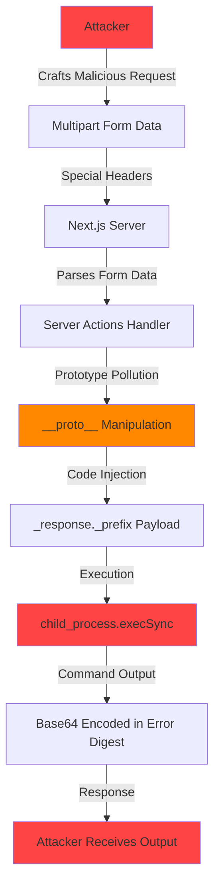

#### Exploitation Sequence

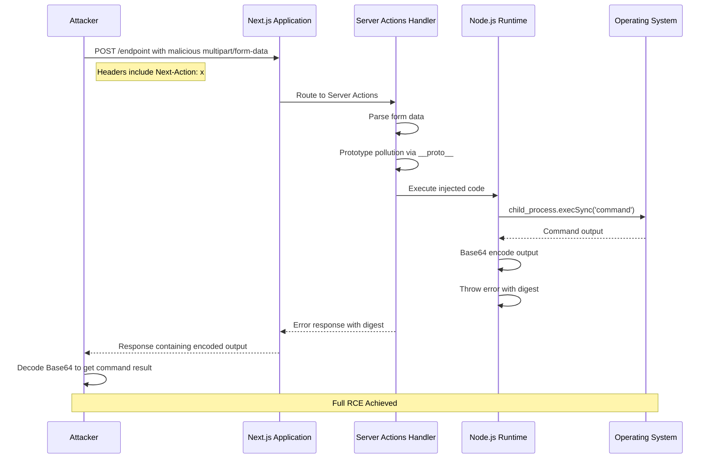

#### Impact Analysis

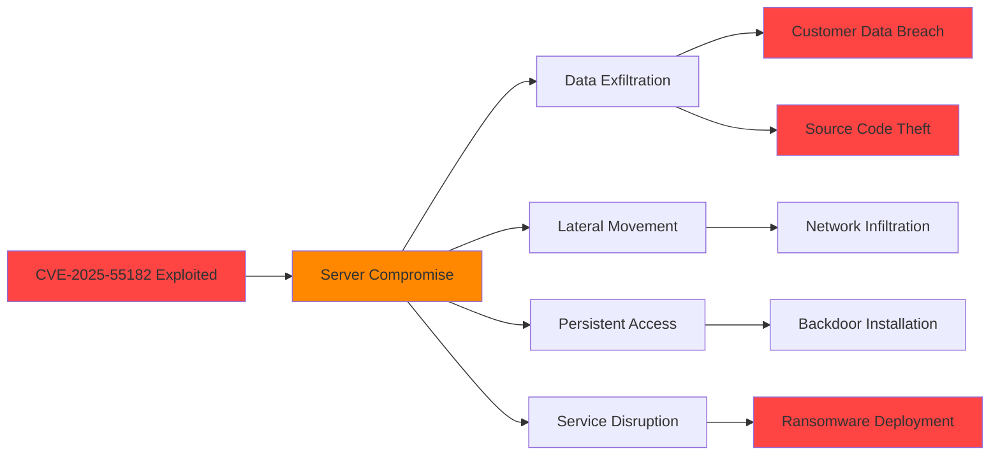

#### Affected Components

- Next.js Server Actions (app router)
- React Server Components
- Multipart form data parsing
- RSC payload deserialization

#### Mitigation

- **Immediate**: Upgrade Next.js to the latest patched version
- **Short-term**: Disable Server Actions if not critical to application
- **WAF Rules**: Block requests with suspicious `Next-Action` headers
- **Input Validation**: Implement strict validation on all Server Action inputs
- **Monitoring**: Log and alert on unusual Server Action patterns
- **Network Segmentation**: Isolate Next.js servers from sensitive internal resources

#### Detection

```bash
# Check for exploitation attempts in access logs
grep -E "Next-Action.*multipart/form-data.*__proto__" /var/log/nginx/access.log

# Monitor for unusual child_process execution
# Use Node.js security monitoring tools
```

#### References

- [NVD Entry](https://nvd.nist.gov/vuln/detail/CVE-2025-55182)
- [Next.js Security Advisory](https://github.com/vercel/next.js/security/advisories)
- [MITRE CVE Entry](https://cve.mitre.org/cgi-bin/cvename.cgi?name=CVE-2025-55182)

---

### CVE-2025-55183: Next.js Server Actions Code Injection

**CVSS Score**: 9.8  
**Affected Software**: Next.js versions with Server Actions enabled  
**Attack Vector**: Network  
**Impact**: Arbitrary Code Injection and Execution

#### Description

A critical code injection vulnerability in Next.js Server Actions allows attackers to inject and execute arbitrary JavaScript code on the server. Unlike CVE-2025-55182, this variant focuses on injecting benign-looking code that executes in the server context without triggering obvious error conditions.

The vulnerability allows attackers to inject code through the `_response._prefix` field that gets evaluated during the RSC payload processing, enabling silent execution of arbitrary JavaScript.

#### Technical Details

**Vulnerability Class**: Code Injection  
**Attack Complexity**: Low  
**Privileges Required**: None  
**User Interaction**: None

This variant:
1. Injects code that executes silently without throwing errors
2. Can be used for reconnaissance and data gathering
3. Enables persistent monitoring of server-side operations
4. Allows manipulation of server state and responses

#### Payload Structure

```javascript
// Code injection payload (DO NOT USE - For educational purposes only)
const payloadJson = {
  "then": "$1:__proto__:then",
  "status": "resolved_model",
  "reason": -1,
  "value": "{\"then\":\"$B1337\"}",
  "_response": {
    "_prefix": "console.log('injected code executing')//",
    "_formData": {
      "get": "$1:constructor:constructor"
    }
  }
};
```

#### Attack Flow

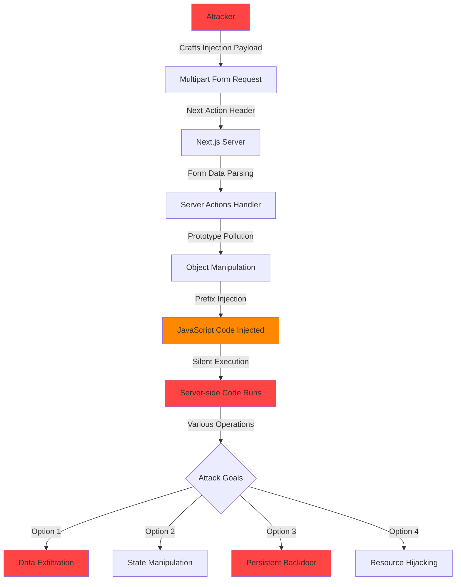

#### Detailed Exploitation Process

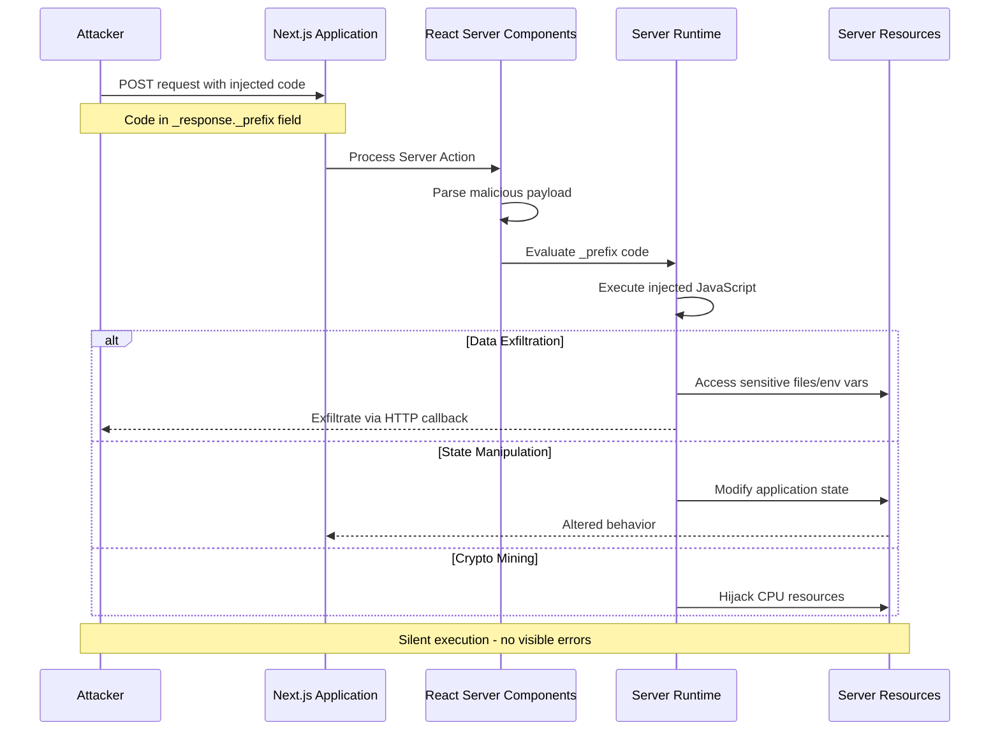

#### Code Injection Variants

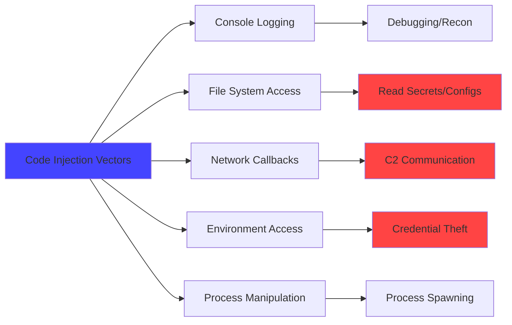

#### Impact

- **Confidentiality**: Access to server-side secrets, environment variables, and configuration
- **Integrity**: Ability to modify server state and response data
- **Availability**: Resource hijacking for cryptocurrency mining or DoS

#### Mitigation

- **Update Immediately**: Patch Next.js to latest secure version
- **Content Security Policy**: Implement strict CSP for Server Actions
- **Runtime Protection**: Use Node.js runtime security tools (e.g., Snyk, Socket)
- **Code Review**: Audit Server Actions for injection vulnerabilities
- **Sandboxing**: Consider isolating Server Actions in containers
- **Rate Limiting**: Implement rate limiting on Server Action endpoints

#### Detection Indicators

```yaml
# Suspicious patterns to monitor
Indicators:
  - Request headers containing "Next-Action" with unusual values
  - Form data containing "__proto__" strings
  - Form data containing "constructor" references
  - Unusual console.log output in production
  - Unexpected outbound network connections from Node.js process
```

#### References

- [NVD Entry](https://nvd.nist.gov/vuln/detail/CVE-2025-55183)
- [Next.js Security Advisory](https://github.com/vercel/next.js/security/advisories)
- [OWASP Code Injection](https://owasp.org/www-community/attacks/Code_Injection)

---

### CVE-2025-55184: Next.js RSC Payload Manipulation

**CVSS Score**: 9.6  
**Affected Software**: Next.js versions with React Server Components  
**Attack Vector**: Network  
**Impact**: Remote Code Execution via Payload Deserialization

#### Description

A critical vulnerability in Next.js React Server Components (RSC) allows attackers to manipulate the RSC payload structure to achieve remote code execution. The vulnerability exists in how the RSC protocol deserializes and processes incoming payloads, allowing attackers to exploit the reference resolution mechanism.

#### Technical Details

**Vulnerability Class**: Insecure Deserialization + RCE  
**Attack Complexity**: Medium  
**Privileges Required**: None  
**User Interaction**: None

The RSC protocol uses special references (like `$1`, `$@0`, `$Q2`) to link payload components. This vulnerability exploits the reference resolution mechanism to:

1. Create self-referential or circular references
2. Inject executable code through resolved references
3. Trigger code execution during payload processing

#### RSC Protocol Overview

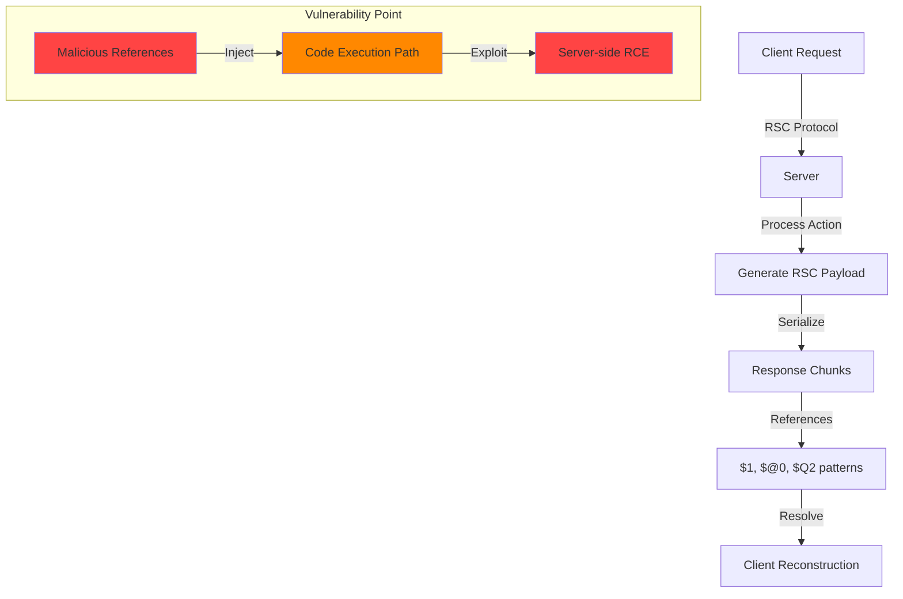

#### Attack Mechanism

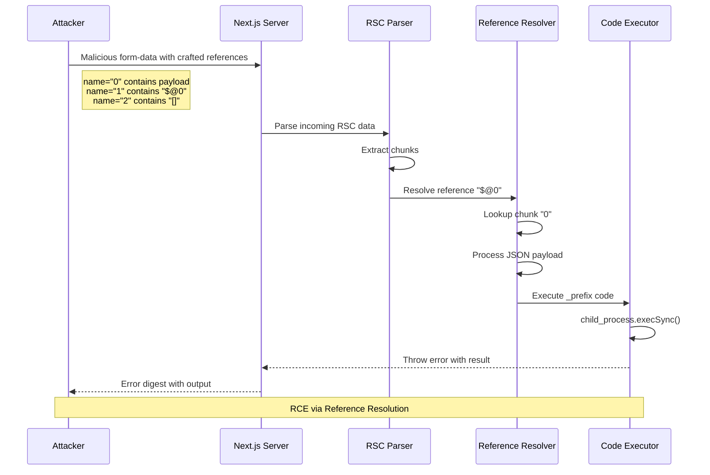

#### Payload Structure Analysis

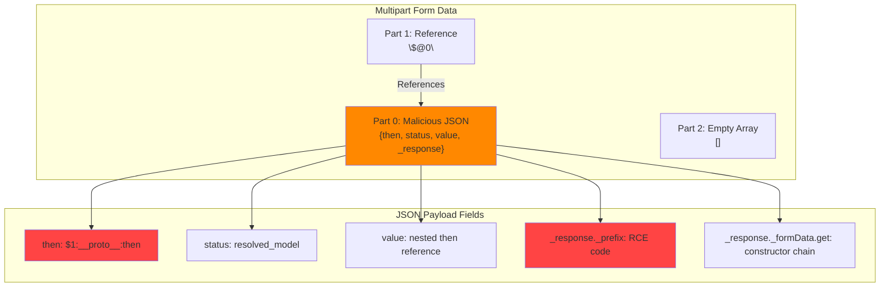

#### Vulnerability Chain

```mermaid
flowchart LR
    A[Form Data Parsing] --> B[Chunk Extraction]
    B --> C[Reference Resolution]
    C --> D[Prototype Access]
    D --> E[Constructor Chain]
    E --> F[Function Construction]
    F --> G[Code Execution]
    G --> H[Command Output]
    H --> I[Data Exfiltration]
    
    style A fill:#4444ff
    style D fill:#ff8800
    style F fill:#ff4444
    style G fill:#ff4444
    style I fill:#ff4444
```

#### Impact Scope

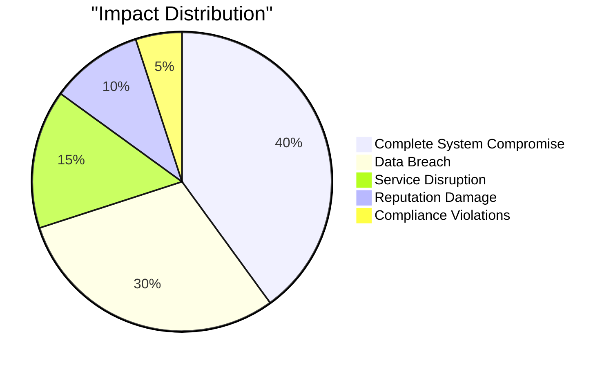

#### Real-World Attack Scenario

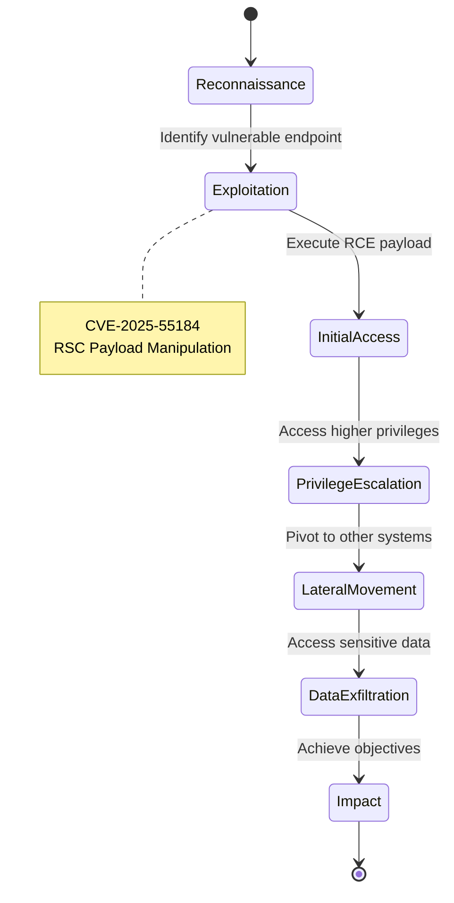

#### Mitigation Strategies

1. **Immediate Patching**
   - Update Next.js to the latest patched version immediately
   - Review changelogs for security fixes

2. **Input Validation**
   ```javascript
   // Example: Validate Server Action inputs
   async function serverAction(formData) {
     // Sanitize and validate all inputs
     const sanitizedData = sanitizeFormData(formData);
     // Check for malicious patterns
     if (containsSuspiciousPatterns(sanitizedData)) {
       throw new Error('Invalid input detected');
     }
     // Process validated data
     return processAction(sanitizedData);
   }
   ```

3. **Network Controls**
   - Implement Web Application Firewall (WAF) rules
   - Block requests with suspicious patterns
   - Rate limit Server Action endpoints

4. **Runtime Protection**
   - Use Node.js security monitoring
   - Implement process isolation
   - Enable strict mode protections

5. **Monitoring and Detection**
   ```yaml
   Detection Rules:
     - Pattern: "__proto__" in request body
     - Pattern: "constructor:constructor" in form data
     - Pattern: Unusual Next-Action header values
     - Behavior: Unexpected child_process spawning
     - Behavior: Unusual outbound connections
   ```

#### References

- [NVD Entry](https://nvd.nist.gov/vuln/detail/CVE-2025-55184)
- [React Server Components Security](https://react.dev/reference/rsc/server-components)
- [Next.js Security Best Practices](https://nextjs.org/docs/app/building-your-application/authentication)

---

## 📈 2025 Vulnerability Trends

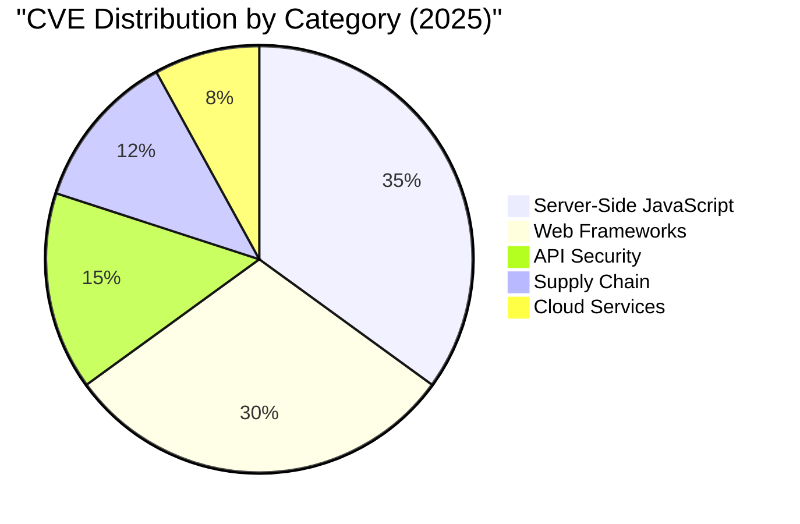

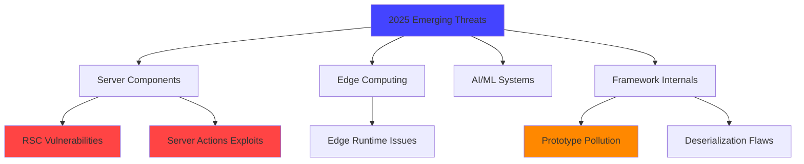

## 🏷️ Technology Tags Summary

- **Next.js**: 3 CVEs
- **React Server Components**: 3 CVEs
- **Server Actions**: 2 CVEs
- **Prototype Pollution**: 2 CVEs
- **Code Injection**: 2 CVEs
- **Deserialization**: 1 CVE

## 🛡️ Security Recommendations for 2025

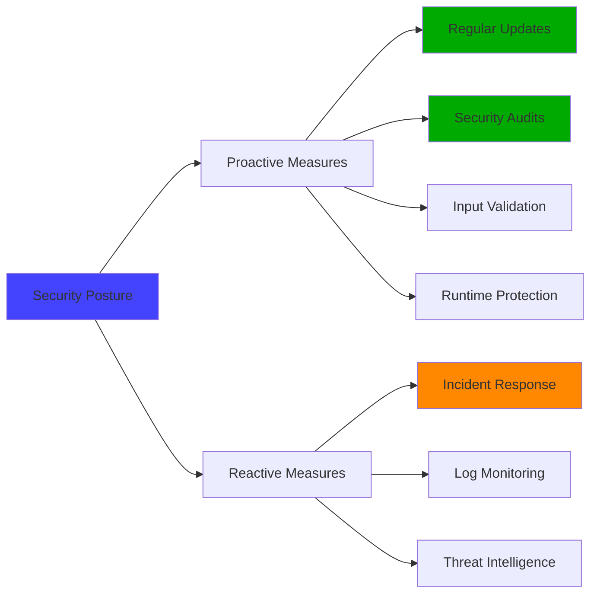

## 📚 Additional Resources

- [CISA Known Exploited Vulnerabilities Catalog 2025](https://www.cisa.gov/known-exploited-vulnerabilities-catalog)
- [NVD 2025 Vulnerabilities](https://nvd.nist.gov/vuln/search/results?isCpeNameSearch=false&pub_start_date=01/01/2025&pub_end_date=12/31/2025)
- [Next.js Security Documentation](https://nextjs.org/docs/app/building-your-application/authentication)
- [OWASP Top 10 2025](https://owasp.org/www-project-top-ten/)

---

**Note**: This is a curated list of CVEs from 2025, focusing on emerging threats in modern web frameworks. The CVEs documented here highlight vulnerabilities in server-side JavaScript frameworks, particularly Next.js Server Actions and React Server Components. The technical details are based on publicly available exploit research. Always verify CVE details from official sources (NVD, vendor advisories) before taking action.

**Last Updated**: December 2025  
**Maintainer**: akashdip2001
